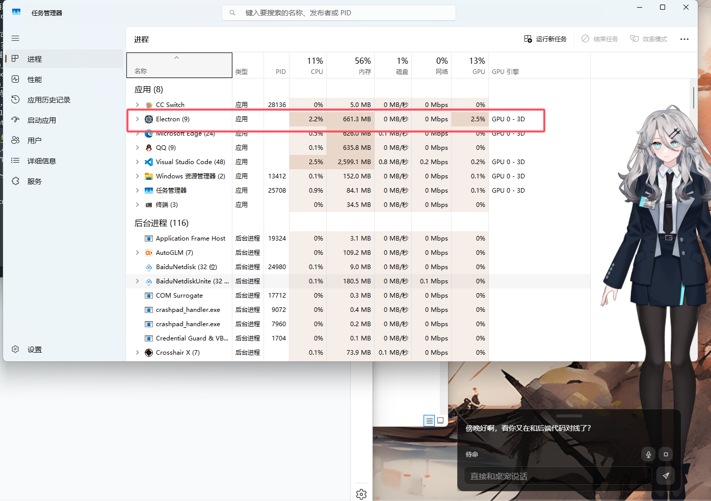

# AG99live

AG99live 是桌宠项目 V2：以 `AstrBot 插件适配器 + Electron 前端运行时` 组成一条可联调、可扩展的实时对话与动作链路。



## 项目目标

- 用统一协议打通 `文本 / 语音 / 图像 / 控制 / 动作`。
- 将 Live2D 扫描产物沉淀为可复用的动作知识（`base_action_library`、`parameter_action_library`）。
- 在真实会话中完成 `语义 -> 动作意图 -> 前端编译参数计划 -> 执行` 的闭环。

## 当前状态（2026-04-25）

### 已完成

- V2 协议主链路已切换完成：`input.* / output.* / control.* / system.* / engine.*`。
- Adapter 已可作为 AstrBot 插件运行，提供 `WebSocket` 实时消息和 `HTTP` 资源服务。
- Live2D 扫描可产出 `parameter_scan`、`base_action_library`、`parameter_action_library`、`calibration_profile`。
- 动作链路支持双路径：主请求内联 `<@anim {...}>` 优先，无内联时 realtime 兜底生成。
- 前端 `ModelEngine` 已能本地编译 `engine.motion_intent.v1 -> engine.parameter_plan.v1`。
- 前端已提供 ModelEngine 表现倍率设置：全局强度默认 `1.35`，12 轴可单独调整。
- 前端动作执行链路已具备 `turn_id` 级动作/音频时间轴协调、计划软衔接（soft handoff）、高频重复计划去重与重启节流。
- 参数绑定容错已增强（含模型参数表回退匹配）。
- 自动化验证基线已建立：`python -m pytest astrbot_plugin_ag99live_adapter/tests -q` -> `48 passed`，AstrBot 插件检查通过，`frontend` 的 `typecheck/build` 可通过。

### 进行中

- 音频、口型、动作的体感一致性仍在持续优化（尤其是语义强度与细节层次）。
- realtime 计划的 supplementary 仍需进一步提升“非眼部可见性”和风格稳定性。

## 仓库结构

```text
AG99live/
├─ astrbot_plugin_ag99live_adapter/   # AstrBot 插件（协议、会话、媒体、Live2D 扫描、realtime motion）
├─ frontend/  # Electron + Vue 客户端（桌宠窗口、设置、历史、Action Lab）
├─ docs/      # 当前有效文档与归档索引
├─ analysis/  # 本地分析实验区（默认不纳入正式文档）
└─ deploy_adapter.ps1
```

## 快速开始

### 1) 前端开发

```powershell
cd frontend
npm install
npm run dev
```

常用命令：

- `npm run typecheck`
- `npm run build:web`

### 2) 后端测试

```powershell
python -m pytest astrbot_plugin_ag99live_adapter/tests -q
```

### 3) 部署 Adapter 到本地 AstrBot 插件目录

```powershell
.\deploy_adapter.ps1
```

可选参数：

- `-PluginsRoot "<AstrBot>\data\plugins"`
- `-DryRun`

## 协议摘要

- 输入：`input.text`、`input.raw_audio_data`、`input.mic_audio_end` 等
- 输出：`output.text`、`output.audio`、`output.image`、`output.transcription`
- 控制：`control.turn_started`、`control.turn_finished`、`control.playback_finished`、`control.error`
- 系统：`system.server_info`、`system.model_sync`、心跳与历史
- 动作：`engine.motion_plan`、`engine.motion_intent`

## 文档入口

- [文档索引](./docs/README.md)
- [归档文档索引](./docs/archive/README.md)
- [V2 当前实现状态与下一步](./docs/V2当前实现状态与下一步.md)
- [前端动作强度设置与 Prompt 指令设计及实现状态](./docs/前端动作强度设置计划.md)
- [前后端严格审阅报告](./docs/前后端严格审阅报告.md)
- [Adapter 说明](./astrbot_plugin_ag99live_adapter/README.md)
- [Frontend 说明](./frontend/README.md)

