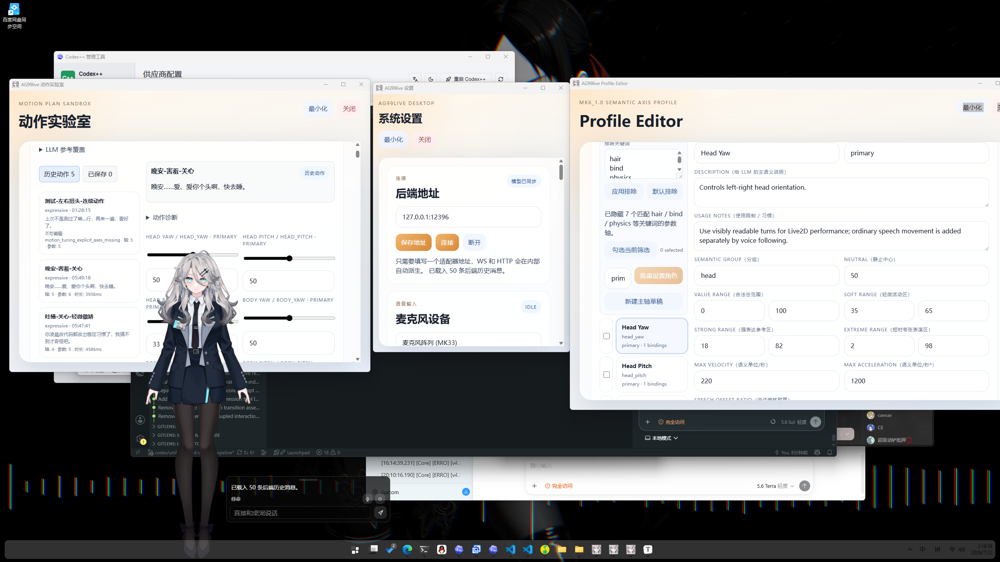
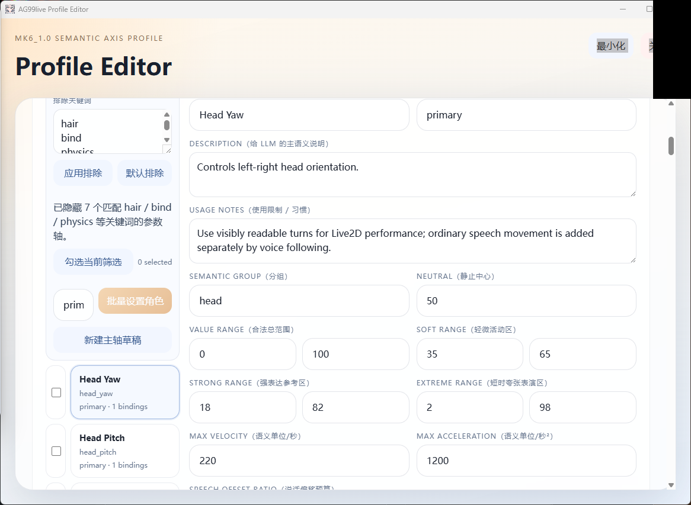
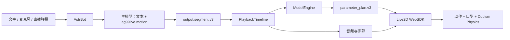

# AG99live

**让大模型不只生成一句回复，而是完成一段 Live2D 表演。**

Windows 桌面端 · AstrBot · Electron · Live2D Cubism · 语义动作生成

[核心差异](#核心差异) · [主要能力](#主要能力) · [快速开始](#快速开始) · [技术文档](./docs/README.md)





## AG99live 是什么

AG99live 是一个运行在桌面上的 Live2D AI 角色系统。

在一次回复中，主模型同时决定：

- **说什么**：回复文本与 TTS 内容。
- **怎么说**：说话期间的表演节奏与头身随动。
- **怎么表现**：头部、身体、视线和面部细节的语义动作。

它不是把“开心”“疑惑”映射到几个固定表情文件，也不是收到文本后随机播放一段动画。

主模型输出九级语义动作，前端 ModelEngine 再根据当前 Live2D 模型的真实能力，将其编译成逐帧参数计划。

```json
{
  "intent_tags": ["疑惑", "轻微调侃"],
  "axis_levels": {
    "head_yaw": 3,
    "body_yaw": -2,
    "head_roll": 3,
    "brow_bias": 3
  }
}
```

`-4..4` 表示方向与强度，不是最终角度。相同语义可以在不同模型上得到不同但可控的动作表现。

## 我们想解决什么问题

传统 Live2D AI 桌宠通常把表现拆成几条互相独立的链路：回复由大模型生成，语音由 TTS 生成，动作从预设动画中挑选，口型再由播放器单独处理。这样容易出现三个问题：

1. 语言表达和动作表达互相脱节，角色说得很激动，身体却没有变化。
2. 动作文件只能覆盖作者提前录制过的少数场景，难以自然组合，也很难迁移到另一个模型。
3. 音频、口型和动作各自计时，播放过程中容易出现提前、延迟、重复释放或无法追踪的状态。

AG99live 选择了一条更基础但更可控的路线：让模型表达“应该怎么表现”，让 ModelEngine 把语义转换成参数，让统一 Timeline 负责这一段表演的时间，让 Live2D runtime 负责逐帧呈现。每一层只拥有自己应该拥有的事实和状态。

## 推荐使用配套优化版 AstrBot

AG99live 推荐使用由项目维护者同步优化的 [AstrBot 配套分支](https://github.com/murphys7017/AstrBot/tree/codex/unify-prompt-context-pipeline)，而不是直接使用官方上游版本。

这不是一个无关的替代发行版。为了配合 AG99live 的响应速度、动作准确性和消息时序，配套版本针对以下基础链路做过持续调整：

- Prompt 与上下文收集边界，减少无关上下文对响应速度和动作判断的干扰。
- Persona Effect 与工具表达链路，让文本和动作意图在同一次模型回复中保持一致。
- 执行准备与 Personal Runtime ownership，减少重复处理和重复输出。
- 输出生命周期、TTS 状态和交互完成判定，让 Adapter 能准确知道一段回复何时真正完成。

AG99live 的当前主链路以这个配套版本作为集成目标。官方 AstrBot 仍可用于理解项目的上游基础能力；当运行环境没有 Persona Effect 注入函数时，AG99live 也保留官方 `<@anim>` 兼容传输，但这不是推荐的默认组合。

## 适合什么场景

AG99live 面向希望把 Live2D 角色作为长期交互主体使用的开发者和创作者：

- 制作有连续对话感的桌面 AI 角色，而不是只能触发固定表情的聊天窗口。
- 让同一套动作语义适配不同 Live2D 模型，并能针对模型能力做细调。
- 观察大模型生成了什么动作、最终为什么变成这个参数，而不是只凭肉眼猜测。
- 把语音、口型、头身随动、物理演算和直播弹幕放进同一条可追踪的交互链路。
- 为后续训练专门的动作生成小模型积累真实的语义动作与播放数据。

它目前首先是一个面向开发和实验的项目，不是一键安装即用的成熟直播软件。项目更重视动作链路的可解释性、可调试性和持续积累能力。

## 核心差异

### 1. 文本和动作由同一个主模型共同生成

主模型在一次回复中生成文本，并通过 `ag99live.motion` Persona Effect 输出动作意图。语言与动作共享同一段上下文，因此不需要再让另一个分类器根据回复猜测情绪。

### 2. 生成参数，而不是选择预设动画

正式主链路使用 `engine.motion_intent.v4`：

```text
LLM 语义动作
  -> 九级锚点与确定性采样
  -> 轴关系图与模型约束
  -> engine.parameter_plan.v3
  -> Live2D 逐帧参数驱动
```

完整 motion 和 expression 仍可作为经过校验的模型资源使用，但它们不是自动动作系统的默认答案，也不会绕过 ModelEngine。

### 3. 音频、字幕、动作和口型属于同一次表演

每个回复段由 `turn_id + message_id` 唯一标识。`PlaybackTimeline` 使用真实音频时钟统一协调：

- TTS 音频播放。
- 文本字幕展示。
- Live2D 参数动作。
- 音频驱动的口型。
- 说话期间的非周期头身随动。

动作不会收到消息就独立计时，口型也不会使用另一套模拟时钟。

### 4. 动作结果可以解释、重放和继续训练

AG99live 会保留从模型原始九级输出到最终参数计划的关键阶段数据。动作为什么被放大、约束或派生，都可以在动作实验室中追踪，而不是只看到最后角色“动了一下”。

## 从一句话到一次表演

### 1. 输入进入 AstrBot

文字、麦克风输入或 B 站直播弹幕先进入 AstrBot。AG99live Adapter 负责把这些输入映射到 AstrBot 的正常对话流程，不在前端另起一套大模型会话。

### 2. 主模型生成文本和动作意图

主模型在生成回复文本的同时，使用 `ag99live.motion` 描述动作方向。例如它可以表达“向右看、轻微歪头、身体向左跟随”，而不需要知道 `ParamAngleX` 或某个 motion 文件的路径。

### 3. Adapter 建立原子回复段

Adapter 使用 `turn_id + message_id` 聚合文本、TTS、动作和其他输出。前端收到的是一个完整的 `output.segment.v3`，而不是几条彼此无法确认归属的独立事件。

### 4. ModelEngine 编译参数

ModelEngine 读取当前模型的 `SemanticAxisProfile`，完成校验、九级采样、轴关系计算、说话随动轨道、参数绑定与响应策略编译，输出 `engine.parameter_plan.v3`。

### 5. PlaybackTimeline 统一释放

有音频时，动作和口型使用同一个 HTMLAudioElement 的真实时钟；音频失败、动作失败或口型失败都会留下明确终态。可选的 performance curve 只影响表现提示，不会阻塞文本、TTS 或基础动作播放。

### 6. Live2D runtime 逐帧执行

WebSDK 在每一帧写入语义参数，随后交给 Cubism 的物理系统处理头发、衣服和饰品。语义参数的平滑、说话随动和物理演算有各自明确的边界，不由同一套随机或插值逻辑混合代替。

## 主要能力

### 语义动作引擎

- 支持单姿态与多段连续动作。
- 支持头部、身体、视线、眼睛、眉毛、嘴角等语义轴。
- 九级强度为不同模型保存独立锚点，并在等级区间内进行可复现采样。
- 轴关系图统一处理头身跟随、有限反向平衡和模型范围约束。
- 普通主要姿态偏向可见的三级动作，四级用于短时、夸张的 Live2D 表演。

### 说话表演与口型

- 从真实 TTS 音频采样口型和语音能量。
- 说话期间生成确定性的非周期手势轨道，而不是固定正弦摇摆。
- 头部先启动，身体以更小幅度延迟跟随。
- 音频能量只调节动作活跃程度，不决定动作方向。
- Cubism Physics 在参数写入后独立计算头发、服装和饰品响应。

### Profile Editor

不同 Live2D 模型的参数名称、有效范围和表现能力并不一致。Profile Editor 用于编辑当前模型的 `SemanticAxisProfile`：

- 设置语义轴角色：`primary / hint / derived / runtime / ambient / debug`。
- 调整中性值、软范围、强动作范围和四级夸张范围。
- 查看九级锚点与真实 Live2D 参数绑定。
- 调整速度、加速度和说话偏移预算。
- 维护轴之间的关系与约束。
- 通过 revision 和 source hash 防止旧配置覆盖新模型。

这使“疑惑歪头”“开心轻晃”等语义不依赖某一套固定参数名，也让新模型的接入不需要修改 Prompt 或播放器源码。

Profile Editor 不是普通的参数面板，而是模型能力和动作语义之间的翻译层。左侧管理当前模型可用的语义轴，右侧编辑轴的说明、分组、范围、锚点、动力学和参数绑定。模型更换后，通常只需要重新扫描并调整 profile，不需要把模型参数名暴露给大模型，也不需要重写动作协议。

几个关键字段分别负责：

- `value_range`：这个语义轴允许使用的合法范围。
- `soft_range`：轻微动作的参考区间。
- `strong_range`：明确可见的强动作参考区间。
- `extreme_range`：短时间夸张表演使用的四级区间。
- `level_anchors`：`-4..4` 九个语义等级对应的确定性锚点。
- `max_velocity / max_acceleration`：参数表现层追赶目标时使用的动力学限制。

编辑器还会排除明显属于物理输出或内部调试的参数，避免把不能由语义动作直接控制的轴误交给模型。

### 动作实验室

动作实验室是面向调试、筛选和数据积累的 Motion Plan Sandbox：

- 查看真实对话产生的动作历史和播放终态。
- 重放已经编译完成的语义动作，不重新经过大模型。
- 对比原始 `axis_levels`、采样值、派生值、约束值和最终参数计划。
- 预览模型扫描得到的基础参数动作。
- 保存、删除和筛选人工认可的动作样本。
- 将筛选样本作为后续 Prompt 参考和训练数据来源。

动作实验室不维护第二套播放实现；预览仍通过 ModelEngine 和 Live2D runtime 的正式参数链路执行。

它解决的是动作系统最难长期迭代的一件事：把“看起来不对”变成可以检查的数据。开发者可以先看模型原始输出，再看采样和轴关系处理，最后看参数计划和播放终态，从而判断问题发生在 Prompt、profile、编译器、Timeline 还是模型 runtime。被人工认可的样本还可以回到 Prompt 参考和后续动作数据积累中。

### 桌面交互

- 文字输入、麦克风输入和按键说话。
- 独立的透明 Live2D 窗口和输入窗口。
- 对话历史、系统设置、动作实验室和 Profile Editor 独立窗口。
- B 站直播弹幕批量输入，可作为普通对话 turn 进入同一回复链路。
- 可选的远程电脑操作委托，将桌面任务交给 Codex app-server / Computer Use 或 OpenCode 执行器。

## 一次互动如何完成


```mermaid
flowchart LR
    U["文字 / 麦克风 / 直播弹幕"] --> A["AstrBot"]
    A --> P["主模型：文本 + ag99live.motion"]
    P --> S["output.segment.v3"]
    S --> T["PlaybackTimeline"]
    T --> AU["音频与字幕"]
    T --> M["ModelEngine"]
    M --> PL["parameter_plan.v3"]
    PL --> L["Live2D WebSDK"]
    AU --> L
    L --> R["动作 + 口型 + Cubism Physics"]
```

正式路径只有一条：

```text
用户输入
  -> AstrBot 生成文本、TTS 与 Persona Effect
  -> Adapter 聚合一个原子 output.segment
  -> PlaybackTimeline 建立同一段播放时钟
  -> ModelEngine 编译动作参数
  -> Live2D WebSDK 逐帧执行动作、口型和物理
  -> 各 sink 报告明确终态
```

`<@anim>` 只用于缺少 Persona Effect 注入能力的官方 AstrBot 兼容环境。它不是动作无效后的 fallback。

## 项目结构

```text
AG99live/
├─ frontend/                          # Electron + Vue 桌面客户端
│  └─ src/
│     ├─ model-engine/               # 语义动作编译器
│     ├─ playback-timeline/          # 统一播放时钟与 sink 生命周期
│     ├─ live2d/                     # Cubism WebSDK 与逐帧执行
│     ├─ motion-lab/                 # 动作记录投递与实验室能力
│     └─ views/                      # 设置、历史、实验室、Profile Editor
├─ astrbot_plugin_ag99live_adapter/  # AstrBot 平台适配器
│  ├─ middleware/                    # Persona Effect 与 Prompt contributor
│  ├─ motion/                        # 动作协议、校验和参考数据
│  ├─ live2d/                        # 模型扫描与 SemanticAxisProfile
│  ├─ runtime/                       # turn、segment 与 Motion Lab 状态
│  └─ protocol/                      # WebSocket 契约与 schema manifest
├─ vts-data-recorder/                # 独立 VTube Studio 原始参数录制器
│  └─ src/ag99_vts_recorder/         # VTS 发现、采样、SQLite 录制与查询 CLI
├─ scripts/                          # schema manifest 等仓库级校验脚本
└─ docs/                             # 当前架构、协议、设计和 Mermaid 图
```

## 快速开始

### 环境要求

- Windows 10/11。
- Node.js 20 或更高版本。
- 一个可运行的 AstrBot 环境。
- 推荐使用 [AG99live 配套优化版 AstrBot](https://github.com/murphys7017/AstrBot/tree/codex/unify-prompt-context-pipeline)。
- Python 3.10 或更高版本。
- 可用的对话模型与 TTS Provider。

### 1. 部署 AstrBot Adapter

将插件目录复制到 AstrBot 的插件目录：

```powershell
Copy-Item -Recurse .\astrbot_plugin_ag99live_adapter "C:\path\to\AstrBot\data\plugins\"
pip install -r .\astrbot_plugin_ag99live_adapter\requirements.txt
```

在 AstrBot 中启用 `AG99live Adapter`，并配置对话模型、TTS Provider 和需要使用的 Live2D 模型。

### 2. 启动桌面端

```powershell
cd frontend
npm install
npm run dev
```

打开 AG99live 设置窗口，连接 Adapter 地址。默认本地配置使用：

```text
WebSocket  127.0.0.1:12396
HTTP       127.0.0.1:12397
```

连接并完成模型同步后，即可通过输入窗口或麦克风开始对话。

## 一期状态

项目一期已经完成主链路的初步闭环：

- AstrBot 输入、回复、TTS 和 Persona Effect 接入。
- 原子 segment 聚合与统一播放 Timeline。
- `engine.motion_intent.v4` 到 `engine.parameter_plan.v3` 的动作编译。
- Live2D 参数动作、说话随动、口型和 Cubism Physics。
- Profile Editor、动作实验室、历史和系统设置窗口。
- B 站直播弹幕输入与可选远程操作委托。

当前仍是持续开发版本。接下来的重点是通过真实对话积累动作数据、继续调校不同模型的 profile、提升说话表演的自然度，并完善安装与发布体验。

### 一期明确不做什么

- 不把动作重新拆成与 AstrBot 平行的第二套对话队列。
- 不让大模型直接输出 Live2D 参数名、文件路径或底层播放器指令。
- 不用 fallback 把非法动作伪装成默认动作。
- 不把 performance curve 变成 TTS 或主播放链路的强依赖。
- 不把 Cubism Physics 的头发和衣服演算混进身体语义参数平滑。

这些限制不是为了减少功能，而是为了让一期主链路保持简单：输入一条消息，AstrBot 生成一次回复，前端用同一段时间线完成一次可观察的 Live2D 表演。

## 后续方向

一期完成的是“从消息到动作表现”的基础闭环，后续会围绕真实数据继续提高表现质量：

- 继续积累和筛选动作实验室样本，观察不同语义和说话场景的动作分布。
- 针对不同 Live2D 模型调校 profile，而不是用一个全局倍率解决所有模型。
- 基于真实对话继续调校已落地的分句非周期手势、静音阈值、重音增益和头身残留。
- 让物理演算、身体表现和语义参数在更多模型上保持稳定的视觉层次。
- 在主链路稳定后，再考虑更轻量的模型动作决策和正式发布安装体验。

其中一个明确的长期方向，是基于动作实验室积累的样本单独微调动作生成小模型。它未来可以负责把文本上下文和角色状态转换为 `axis_levels` / `motion_steps`，但不会取代当前的参数编译、Timeline 同步和 Live2D 执行层。现阶段先使用主模型完成文本与动作的联合生成，继续积累高质量数据。

仓库还包含独立的 `vts-data-recorder`：它直接记录本机 VTube Studio 的 tracking input 与 Live2D 参数原始时间序列，和 Motion Lab 数据库完全隔离。当前可用于发现、采样、录制、查询和删除原始 take；语义标注、审核界面与训练导出尚未实现，具体边界见[录制器架构](./docs/05-小模型训练/03-独立VTS录制器与训练导出架构.md)。

## 技术文档

完整架构和协议从 [文档中心](./docs/README.md) 开始：

- [项目总览与模块职责](./docs/01-架构与结构/01-项目总览与模块职责.md)
- [WebSocket 协议契约](./docs/01-架构与结构/02-WebSocket协议契约.md)
- [端到端消息与统一播放链路](./docs/01-架构与结构/05-端到端消息播放时序图.md)
- [ModelEngine 边界与分层设计](./docs/02-设计文档/01-ModelEngine边界与分层设计.md)
- [动作参数处理与轴关系图](./docs/02-设计文档/13-动作参数处理与轴关系图.md)
- [独立 VTube Studio 录制器与训练导出架构](./docs/05-小模型训练/03-独立VTS录制器与训练导出架构.md)
- [流程图与分析图集](./docs/04-流程图与分析图/README.md)

## 模型资源说明

仓库中的 Live2D 模型、贴图、动作和预览图可能拥有独立的使用许可。使用、再分发或商用前，请阅读对应模型目录内附带的许可协议。项目代码与第三方 SDK 的授权范围也应分别确认。
