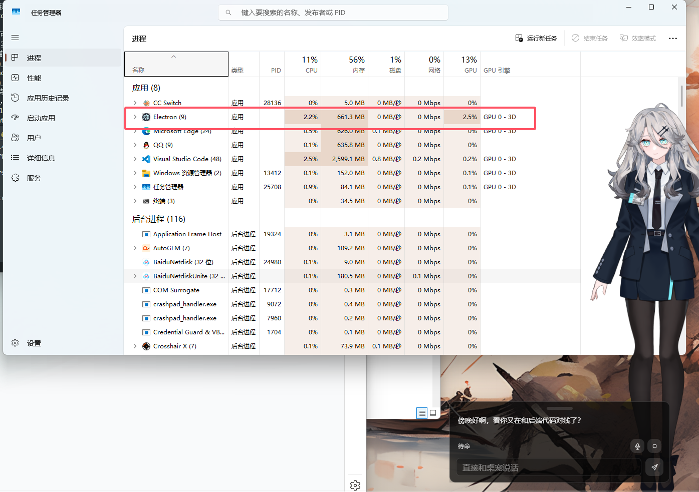

<div align="center">

# AG99live

一个接入 AstrBot 的本地桌面 AI Live2D 助手。

会听你说话，会用语音回应，也会用表情、视线、头部和身体动作表达当前对话。



[快速开始](#快速开始) · [功能亮点](#功能亮点) · [技术文档](./docs/README.md)

</div>

## 项目简介

AG99live 是一个面向桌面陪伴场景的 AI 虚拟形象项目。它把 AstrBot 对话能力、语音输入输出、Electron 桌面窗口和 Live2D 渲染串在一起，让 AI 回复不只停留在文字里，而是由一个桌面角色说出来、动起来。

你可以把它理解成：

- 一个运行在本机桌面上的 AI 桌宠。
- 一个能连接 AstrBot 的 Live2D 前端。
- 一个用于实验“AI 对话如何驱动角色表演”的动作系统。

它和普通聊天软件的区别在于，AG99live 关心的不只是“回复了什么”，还关心角色在回复时应该如何看你、如何转头、如何带动身体、如何利用模型资源理解动作骨架，以及如何生成新的语义动作。

## 功能亮点

### 实时桌宠对话

支持文字输入和麦克风输入。用户说话或输入文字后，前端会把消息发送到 AstrBot 插件后端，再由后端协调 AI 回复、语音和动作。Electron 桌面端在 Windows 上优先使用主进程 DirectShow/ffmpeg 原生麦克风枚举与采集，因此可以选择系统中真实存在的输入设备；不可用时再回退到浏览器 `MediaDevices` 路径。

### Windows 操作委托

AG99live 可以把“操作电脑、打开软件、查看桌面状态”等请求交给远程执行器链路。Adapter 负责识别可用电脑、注入远程执行器 prompt、把任务级 JSON 转发到 Codex app-server；app-server 侧通过 `computer-use:computer-use` skill 执行 Windows 桌面观察和操作。AstrBot 主模型不直接输出坐标、UIA selector 或 shell 步骤，只描述任务目标、约束和成功标准。

### 文本、语音、动作同步播放

一次回复可以同时包含文本、音频和动作指令。前端播放管线按 `turn_id + message_id` 聚合同一回复片段，协调文字显示、音频播放和 Live2D 动作起播，避免角色表现和声音脱节。队列关闭信号 `synth_finished` 到达后，前端仍允许同一片段的晚到音频在最终结算前补齐；重复音频不会再次播放。

### 语义驱动的 Live2D 表现

AG99live 会把“解释、疑惑、开心、强调、安静聆听”等对话语义转换成 Live2D 参数计划。动作不只覆盖表情，也包括头部朝向、视线、身体扭转、说话随动等姿态变化。

### 模型资源分析与语义动作

项目会扫描 Live2D 模型自带的 motion / expression 资源，用它们分析模型真实参数曲线、动作骨架和 fallback pose 候选。当前自动动作链路不让 AI 选择 motion3、exp3、catalog motion 或旧播放文件，而是输出 `engine.motion_intent.v3` 语义轴，再由前端 ModelEngine 编译成参数计划。

### 动作实验室

动作实验室用于检查和调校 AI 生成的动作。你可以预览动作、查看历史动作、调整参数、选择情绪标签，并把满意的样本保存下来，作为后续生成风格的参考。

### 语义轴档案

不同 Live2D 模型的参数差异很大。AG99live 使用语义轴档案把“头部偏转、身体扭转、笑意、视线方向”等抽象动作概念映射到具体模型参数，让同一套动作意图可以落到不同模型上。

### 说话姿态随动

角色说话时不只是嘴巴动。前端动作引擎会在音频播放期间补充克制的头部和身体姿态变化，并结合音频响度做轻量调制，让说话状态更像一个正在表达的角色。

## 一次互动会发生什么

```text
用户输入文字或语音
  -> 前端桌宠发送到 AstrBot 插件
    -> AstrBot / LLM 生成回复
      -> 后端输出文本、音频、动作意图
        -> 前端同步播放
          -> Live2D 模型显示表情和姿态变化
```

这条链路是项目当前最核心的部分。很多功能，包括动作实验室、语义轴、模型资源分析、fallback pose 和说话随动，都是围绕这条链路继续打磨角色表现。

## 当前状态

项目已经具备初步可用的本地桌宠闭环：

- Electron + Vue 桌面客户端。
- AstrBot 插件后端。
- WebSocket 前后端协议。
- 文本、音频、动作同步播放。
- 麦克风输入与语音转文字路径，Windows 桌面端支持原生设备枚举、设备选择和自定义按键说话。
- 远程执行器接入，可把 Windows 桌面操作任务委托给 Codex app-server / Computer Use。
- Live2D 模型资源扫描。
- 语义轴动作生成、fallback pose 候选和模型资源分析。
- 动作实验室和动作样本保存。
- 语义轴档案和前端动作编译。

它仍然是持续开发中的项目。当前重点是把角色表现做自然：减少僵硬重复、改善说话随动、提高动作选择质量，并让用户可以用动作样本逐步塑造自己的桌宠风格。

## 项目结构

```text
AG99live/
├─ frontend/                          # Electron + Vue 桌宠客户端
├─ astrbot_plugin_ag99live_adapter/   # AstrBot 插件后端和 Live2D 适配层
├─ docs/                              # 架构、协议、动作系统和运行文档
└─ tools/                             # 开发辅助脚本
```

## 快速开始

### 启动前端开发环境

```powershell
cd frontend
npm install
npm run dev
```

### 运行后端测试

```powershell
python -m pytest astrbot_plugin_ag99live_adapter/tests -q
```

### 部署 AstrBot 适配器

把 `astrbot_plugin_ag99live_adapter/` 目录放到 AstrBot 的插件目录中：

```powershell
Copy-Item -Recurse .\astrbot_plugin_ag99live_adapter "C:\path\to\AstrBot\data\plugins\"
```

然后在 AstrBot 中启用该插件。仓库根目录下的本地部署脚本只用于个人测试，不作为项目部署方式维护。

## 技术文档

如果你想了解内部结构，建议从 [docs/README.md](./docs/README.md) 开始。常用入口：

- [项目总览与模块职责](./docs/01-架构与结构/01-项目总览与模块职责.md)
- [WebSocket 协议契约](./docs/01-架构与结构/02-WebSocket协议契约.md)
- [前后端动作链路结构](./docs/01-架构与结构/03-前后端动作链路结构.md)
- [播放同步编排设计](./docs/01-架构与结构/04-播放同步编排设计.md)
- [ModelEngine 边界与分层设计](./docs/02-设计文档/01-ModelEngine边界与分层设计.md)

## 说明

AG99live 目前更接近一个本地实验型桌宠系统，而不是已经产品化的一键安装应用。README 只描述当前已经形成闭环的能力；架构和运行边界以 `docs/` 中的当前设计文档为准。
