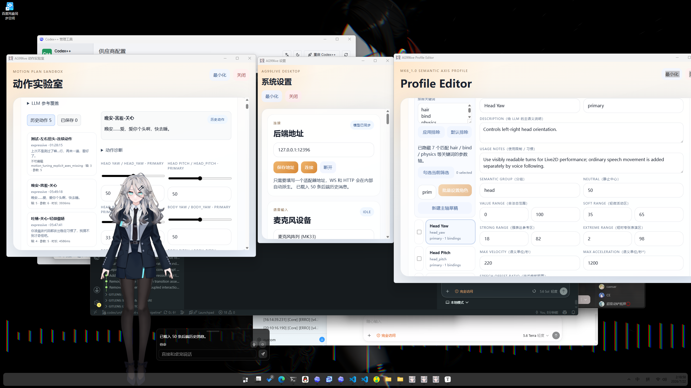
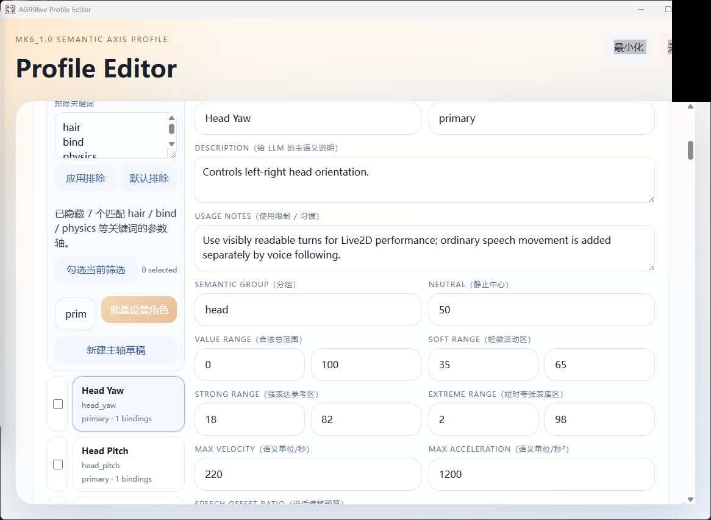

# AG99live

**让 AstrBot 真正出现在你的桌面上。**

一个能说话、看向你、做出姿态与表情，并能进入直播画面的 Live2D 桌面伴侣。

Windows 桌面端 · AstrBot · Electron · Live2D Cubism · Spout2

[开始运行](#快速开始) · [看看它能做什么](#为创作和直播而生) · [接入 OBS](#在-obs-中使用透明-live2d-源) · [浏览文档](docs/README.md)





## 让每一次回应都有存在感

AG99live 为 AstrBot 提供一具可见、可听、可持续演出的桌面身体。

当 AstrBot 生成回答时，AG99live 同时组织语音、字幕、视线、头身姿态、面部细节、口型和物理效果。角色的表现随内容与语气变化，整段演出沿同一播放时钟推进，结束、中断和下一段回复也都有明确的生命周期。

它适合希望把 AI 角色做成长期桌面伴侣、互动角色或直播形象的开发者与创作者：

- 在日常聊天中，让角色用声音、目光和动作表达回应。
- 为 Live2D 模型建立可复用的语义表现能力，而不是维护大量固定情绪动画。
- 在 OBS 中获得带透明 Alpha 的 Live2D 图层，用于直播、录屏和虚拟形象场景。
- 从 Prompt、动作语义、参数计划到播放终态完整观察一次表演，持续调校角色表现。

## 从一句话到一段表演

主模型无需了解 `ParamAngleX`、motion 文件路径或底层播放器指令。它只描述角色应该如何表现；AG99live 再根据当前模型的能力档案生成实际的参数计划。

```text
用户输入
  -> AstrBot：文本 + TTS + ag99live.motion
  -> Adapter：output.segment 消息（Payload Schema 为 output.segment.v5）
  -> PlaybackTimeline：同一段时钟和终态
  -> ModelEngine：engine.motion_intent.v4 -> engine.parameter_plan.v3
  -> Live2D runtime：参数、口型、Physics 和绘制
```

例如，“认真解释、稍微偏头、看向用户”会成为模型无关的动作语义；当前 Live2D 模型的 `SemanticAxisProfile` 决定它最终如何映射为头部、身体、视线和面部参数。

## 为创作和直播而生

### 语义驱动的角色表现

用 `-4..4` 的方向和强度描述头部、身体、视线和面部等语义轴。系统支持单姿态、稀疏动作序列和已公开的模型动作资源，让角色能在解释、调侃、强调和停顿时形成不同的表现节奏。

### 声音、字幕、动作同频发生

每个回复由 `turn_id`、`message_id` 和 `sequence` 标识。音频、字幕、参数动作与口型在同一个播放段内协调，避免角色已经转身、语音仍在继续的割裂体验。

### 一套语义，适配不同模型

Profile Editor 保存每个 Live2D 模型的 `SemanticAxisProfile`、参数范围、九级锚点、关系图和响应设置。更换模型后，开发者可以重新校准表现能力，保留上层的动作语言和对话设计。

### 看得见的调校过程

Motion Lab 记录动作输入、编译诊断、参数计划与播放终态。你可以重放一次已编译的动作，比较原始语义和最终参数，筛选高质量样本作为后续 Prompt 参考。

### 直接进入 OBS 的透明角色图层

Windows 桌面端将已经绘制的透明 Live2D canvas 发布为 Spout2 Sender。OBS 获取的是角色图层本身，桌面、设置窗口、终端和输入窗口不会出现在透明区域中。

## 快速开始

### 环境

- Windows 10 或 11。
- Node.js 20 或更高版本。
- 可运行的 AstrBot 环境、对话模型和 TTS Provider。
- 与 AstrBot 和插件依赖兼容的 Python 环境。

增强链路以维护者的 [AstrBot 配套分支](https://github.com/murphys7017/AstrBot) 为集成目标。官方 AstrBot 可以通过 `<@anim>` 使用兼容传输入口；该入口不承担增强 Persona Effect 的失败降级。

### 1. 安装并启用 Adapter

将 `astrbot_plugin_ag99live_adapter/` 放到 AstrBot 的插件目录。下面的命令在 AG99live 仓库根目录执行，并使用 AstrBot 当前的 Python 环境安装依赖：

```powershell
python -m pip install -r .\astrbot_plugin_ag99live_adapter\requirements.txt
```

启用 `AG99live Adapter` 后，默认服务只绑定本机回环地址：

| 服务 | 默认地址 |
| --- | --- |
| WebSocket | `ws://127.0.0.1:12396` |
| 静态资源与媒体 | `http://127.0.0.1:12397` |

端口、角色名、自动麦克风及各项运行设置由 AstrBot 插件配置管理。首次运行后在 AstrBot 的插件配置界面按当前 Schema 填写，不要沿用旧的平级配置键。

### 2. 启动桌面端

```powershell
cd frontend
npm install
npm run dev
```

在设置窗口连接 Adapter，完成模型同步并选择 Live2D 模型后，即可从输入窗口或麦克风发起对话。

### 在 OBS 中使用透明 Live2D 源

桌面端会启动名为 `AG99live.Live2D` 的 Spout2 Sender。OBS 中添加 **Spout2 Capture**，选择该 Sender，并使用**预乘 Alpha**合成模式。

开发环境如需重新生成 Sender：

```powershell
cd frontend
npm run build:spout-sender
```

该构建需要 Windows 上的 Visual Studio Build Tools（MSVC x64）。仓库的 `frontend/resources/spout/` 已包含 Sender 和所需的 Spout2 运行库；自行打包桌面端时，请将该目录复制到运行包的 `resources/spout/`。Sender 无法启动时，桌面端仍可正常运行，但不会提供 Spout 输出。

## 当前状态与验证范围

截至 **2026 年 9 月 29 日**，源码已包含完整的 Adapter、`output.segment` 消息（Payload Schema 为 `output.segment.v5`）、播放 Timeline、ModelEngine、Live2D runtime 和 Spout2 输出链路。协议版本以 `astrbot_plugin_ag99live_adapter/protocol/schema_manifest.json` 为准。

真实桌面环境仍需确认以下体验：

- 连续消息的顺序、取消和所有终态。
- 首段音频、字幕、口型和参数动作的同步。
- 模型切换、设备切换和断线后的资源释放。
- Spout2 的透明边缘、帧率以及桌面端重启后的恢复。

## 文档与开发

深入的架构、协议、播放、动作编译、运行验收和 VTube Studio 数据录制说明见[文档中心](docs/README.md)。

```powershell
python scripts/check_protocol_schema_manifest.py

cd frontend
npm run typecheck
```

这些检查覆盖生成的协议清单和 TypeScript 类型；完整行为仍要通过真实桌面运行验收。

## 模型与第三方资源

仓库中的 Live2D 模型、贴图、动作和预览图可能具有独立许可。使用、再分发或商用前，请阅读对应模型目录及第三方 SDK 所附的授权文件。
