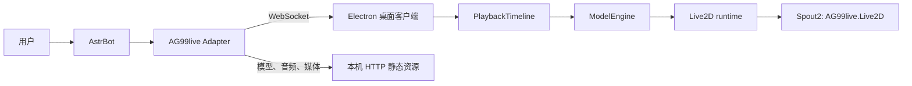

# 项目总览与模块职责

## 定位

AG99live 将 AstrBot 的一次回复呈现为桌面 Live2D 表演。它包含两类进程：AstrBot 内的 Python Adapter 和 Electron 桌面客户端；两者通过本机 WebSocket 和静态资源服务协作。



## 模块边界

| 模块 | 负责 | 不负责 |
| --- | --- | --- |
| AstrBot | 对话、文本、TTS、Persona 调用和平台事件 | Live2D 参数映射、播放时钟和渲染。 |
| Adapter | 输入适配、严格协议校验、段聚合、模型资源服务和运行状态 | 修复非法动作、逐帧参数计算和浏览器播放。 |
| `TurnPlaybackSessionStore` | 稳定保存入站段、播放投影和终态 | 播放媒体或解释动作语义。 |
| `PlaybackTimeline` | 段的时钟、sink 协调、停止与完成收口 | 推断动作参数。 |
| `ModelEngine` | 语义校验、profile 解析、编译、资源预检和动作生命周期 | 创建第二个时钟或修改后端对话。 |
| AG99 Live2D runtime | 参数融合、口型、模型更新和绘制 | 读取 Turn 业务状态或 Persona 输入。 |
| Cubism Framework / Core | 已写入参数后的模型更新、Physics 和底层绘制 | AG99 的协议、动作语义和业务策略。 |

## 仓库结构

```text
AG99live/
├─ astrbot_plugin_ag99live_adapter/  # AstrBot 插件、协议、模型扫描与运行状态
├─ frontend/                         # Electron、Vue、Timeline、ModelEngine、Live2D runtime
│  ├─ electron/                      # 主进程、窗口、原生麦克风、Spout Sender
│  ├─ src/                           # 渲染进程和共享 TypeScript 逻辑
│  └─ native/spout/                  # 独立的 Windows Spout2 Sender 源码
├─ vts-data-recorder/                # 独立 VTube Studio 原始参数录制器
├─ scripts/                          # 仓库级协议清单检查
└─ docs/                             # 现行工程文档
```

## 桌面运行时

Electron 主进程创建透明宠物窗口和设置、历史、动作实验室、Profile Editor 等辅助窗口。渲染进程只通过预加载桥接调用桌面能力；主进程持有窗口、原生麦克风、全局按键和 Spout Sender 等系统资源。

Live2D 画布完成一帧绘制后，渲染进程读取该画布的预乘 Alpha RGBA 像素，通过受限 IPC 交给主进程，再由独立的 Windows Sender 进程发布给 Spout2。该输出没有截取桌面。

## 配置与模型资料

Adapter 默认只监听 `127.0.0.1`：WebSocket 端口为 `12396`，静态资源端口为 `12397`。模型同步使用 `live2d_scan.v4`；当前模型的 `SemanticAxisProfile`、语音随动资料和可播放资源由 Adapter 提供给前端。

Profile 是模型专属能力档案，包含语义轴、参数绑定、范围、九级锚点、关系图和响应设置。更换模型时应扫描并校准该模型的 profile，而不是改变大模型动作语言或在前端硬编码参数名。

## 延伸阅读

- [WebSocket 协议契约](02-WebSocket协议契约.md)
- [前后端动作链路结构](03-前后端动作链路结构.md)
- [播放同步编排设计](04-播放同步编排设计.md)
- [ModelEngine 边界与分层设计](../02-设计文档/01-ModelEngine边界与分层设计.md)
