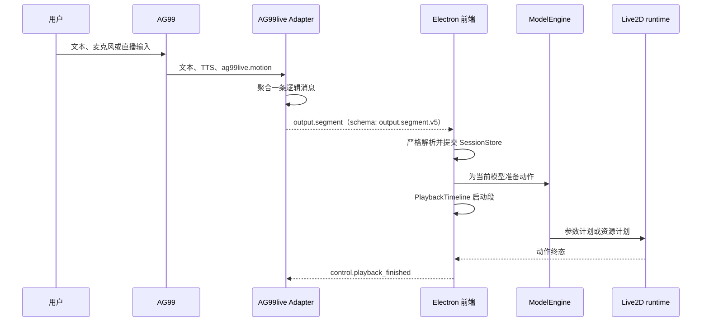

# 前后端动作链路结构

## 主路径

## 后端职责

Adapter 通过 AG99 扩展收集 Persona Effect，并对 `ag99live.motion` 做结构校验。它不把模型输出当作 Live2D 参数，也不修复无效语义。Adapter 同时收集一条逻辑消息需要的文本、TTS、图片、speech cues 和动作资料；满足发送条件后立即提交一个 `output.segment` 消息，Payload Schema 为 `output.segment.v5`。

增强 AG99 链路在逻辑消息的物理发送全部成功后确认该 `message_id`，因而 Adapter 可以独立发送该段，而不必等待同一 Turn 的全部后续消息。这里发送的是 `output.segment` 消息，Payload Schema 为 `output.segment.v5`。Turn 结束信号只负责说明后端输出已收口，不承担“补发已有段”的职责。

## 前端职责

前端先从 AdapterConnection 解析消息，再由 `TurnPlaybackSessionStore` 管理稳定事实。`TurnPlaybackOrchestrator` 为每个可播放段建立任务，`PlaybackTimelineRuntime` 管理需要同步的音频、字幕、动作和口型 sink。

ModelEngine 使用当前 `SemanticAxisProfile` 编译动作。成功时产生 `engine.parameter_plan.v3` 或可播放动作资源；失败时返回诊断和终态，不能用默认姿态冒充成功。Live2D runtime 在帧内融合计划、语音随动和当前 Cubism 基值，随后让 Cubism 完成 Physics 与绘制。

## 本地交互

文本、PTT、持续收音、桌面截图和直播弹幕最终都进入 AG99 的同一对话入口。前端的思考摇摆只是一种本地、可释放的参数贡献：正式 Turn 开始、回复动作启动、中断或终态都会使其交还控制权；它不创建第二个对话队列。

## 资源和媒体

Adapter 的 HTTP 服务提供已扫描模型、模型资源、缓存音频和允许的媒体。ModelEngine 使用模型同步资料和预加载资源；模型未就绪、资源缓存缺失或 URL 无效会明确失败，而不是临时异步获取并改变已有播放运行的状态。

## 不变量

- SessionStore 不播放媒体。
- PlaybackTimeline 不解释动作语义。
- ModelEngine 不创建新的播放时钟。
- Live2D runtime 不读取 Turn、消息或 Persona 业务状态。
- Cubism Framework / Core 不承担 AG99 协议和表演策略。

这些边界使输入、播放和参数表现可以独立审计。
