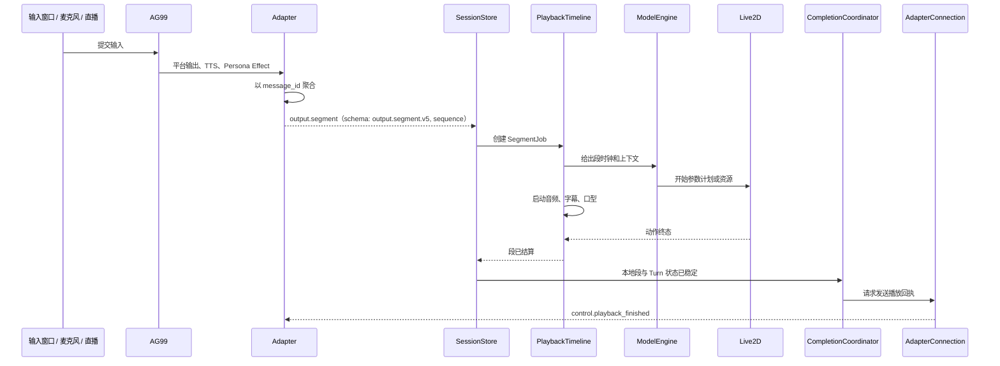

# 端到端消息播放时序

## 正常路径

## 输入到 Turn

- 文本和直播弹幕直接建立正式 Turn。
- PTT 采集会话以松键结束；该会话的根 `turn_id` 可直接成为正式 Turn。
- 持续收音的根 `turn_id` 只代表采集会话。VAD 每检测到一段语音，会派生 `<capture_turn_id>:vad:<n>` 作为正式对话、输出和播放身份。
- 新语音开始时只中断同一采集根下仍在飞的 VAD 子 Turn，不停止持续采集本身。

## 段的顺序和完成

一个 Turn 可以包含多个逻辑消息。`message_id` 标识逻辑消息，`sequence` 给出该 Turn 内的播放顺序。Adapter 在一条逻辑消息已完成时立刻提交其段；`control.synth_finished` 只在后端不再有待发送段时到达。

前端把重复或晚到段当作协议拒绝，而不是重新打开已完成的播放。它完成一段时必须同时结束该段的媒体、动作运行和播放投影，再发送与该段一致的完成回执。

## 失败路径

| 位置 | 处理原则 |
| --- | --- |
| 入站解析 | 拒绝未知版本、非法 URL、重复或不完整 slot，不生成猜测数据。 |
| 动作编译 | 返回精确诊断；不以默认动作替代。 |
| 音频或运行时 | 结算所有已开启资源，保留真实失败状态。 |
| 中断 | 只清理目标 Turn 的运行；晚到输出不能重新进入播放。 |
| WebSocket 断开 | 后端请求停止在飞事件并清理映射；前端释放连接拥有的媒体、Timeline 和监听器。 |

## 透明输出时序

Live2D runtime 完成画布绘制后，桌面渲染进程才读取 RGBA 帧。主进程只接受宠物窗口发来的帧，并转交给 `AG99live.Live2D` Spout Sender。这样 OBS 获得的是 Live2D 图层而不是桌面合成结果。
