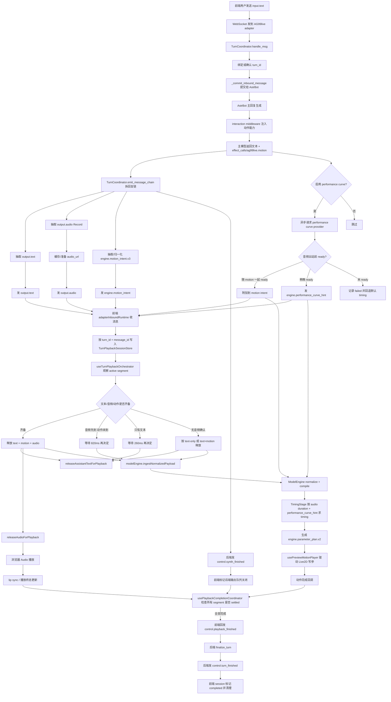
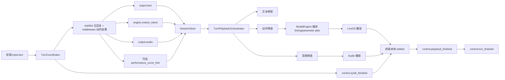

# 端到端消息播放时序图

本文把 AG99live 当前“收到消息 -> 后端响应 -> 前端播放 -> 回执收口”的主链路画成两张图：

- 一张详细版，适合排查问题和看边界
- 一张浓缩版，适合讨论和快速对齐

图中流程基于当前真实实现，主要对应：

- `astrbot_plugin_ag99live_adapter/runtime/turn_coordinator.py`
- `frontend/src/adapter-connection/inbound/adapterInboundRuntime.ts`
- `frontend/src/turn-playback/useTurnPlaybackSessionStore.ts`
- `frontend/src/turn-playback/useTurnPlaybackOrchestrator.ts`
- `frontend/src/model-engine/*`
- `frontend/src/turn-playback/usePlaybackCompletionCoordinator.ts`

## 1. 详细版

## 2. 浓缩版

## 3. 阅读提示

- `TurnCoordinator` 是后端轮次和协议编排中枢
- `TurnPlaybackSessionStore` 是前端这轮播放的事实来源
- `useTurnPlaybackOrchestrator` 只负责“什么时候开始放”
- `usePlaybackCompletionCoordinator` 只负责“什么时候这轮真的结束”
- `performance_curve_hint` 只辅助 timing，不替代 `engine.motion_intent`
