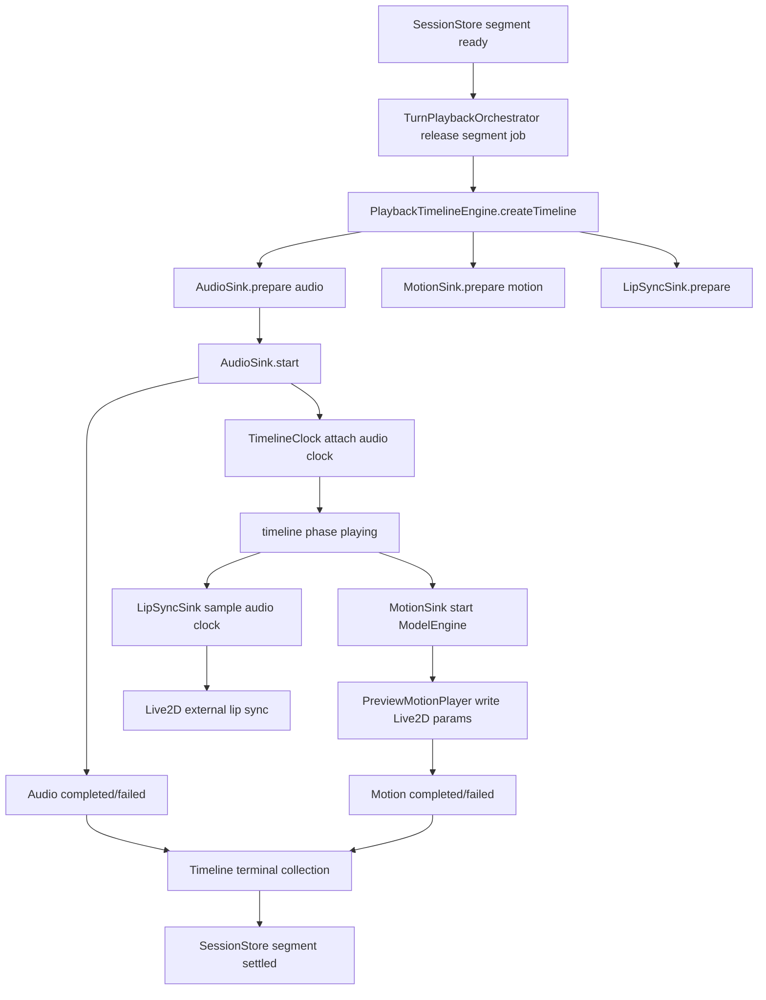
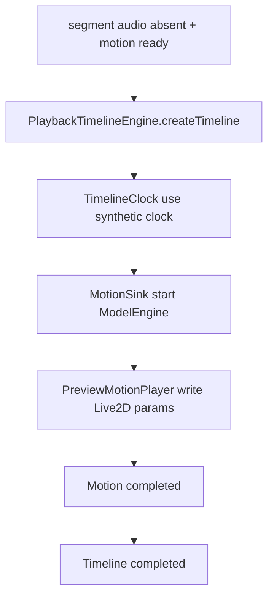

# 统一时钟引擎改造设计

> 文档状态：演进中。Phase 1 纯逻辑 timeline 已实现；Phase 2 已把真实音频播放接入 timeline；Phase 3 已把 motion release context、audio-start event、motion-only synthetic timeline、motion terminal 回写和 segment job preparation 接入统一 timeline；AudioSink / MotionSink / LipSyncSink 适配层已落地，motion 作为 required sink、lip sync 作为 optional sink 进入 PlaybackTimelineEngine 的 terminal 集合；下一步是把剩余 release / event 分发继续收进 timeline。
>
> 本文定义 AG99live 下一阶段播放架构目标：把音频播放、动作播放、嘴型同步、表演曲线求值统一到同一个 segment timeline 下。目标不是把所有实现塞进 `ModelEngine`，而是在它上层建立一个统一时钟与生命周期中枢，让各表现模块订阅同一条时间轴。

## 1. 背景

当前播放链路已经有清楚的 turn / segment 边界：

```text
turn_id
  -> TurnPlaybackSession
message_id
  -> TurnPlaybackSegment
       -> text
       -> audio
       -> motion
```

前端现在的播放组织方式是：

```text
协议事件
  -> TurnPlaybackSessionStore
  -> useTurnPlaybackOrchestrator
  -> audio runtime / ModelEngine / lip sync
  -> usePlaybackCompletionCoordinator
```

这套结构的边界基本正确，但表现执行层仍然分散：

- 音频由 adapter connection 下的 audio runtime 播放。
- 动作由 `ModelEngine -> PreviewMotionPlayer` 播放。
- lip sync 挂在音频播放逻辑附近，通过 Live2D runtime 写嘴型值。
- performance curve hint 由 `ModelEngine` 编译阶段读取，再根据音频时长求 timing。
- 起播同步曾依赖 orchestrator 等待窗口，以及 `ModelEngine` 内部对音频起播的二次等待；当前已开始把真实 audio-start event 收到 audio timeline。

这意味着当前系统是“同一 segment 聚合后，多个执行器互相对齐”，而不是“一个统一 timeline 驱动多个表现 sink”。随着动作、嘴型、表情曲线和音频节奏越来越精细，这种分散时序会持续放大调试成本。

## 2. 最终图景

目标结构是新增一个前端统一播放时间轴：

```text
TurnPlaybackOrchestrator
  -> release segment playback job
  -> PlaybackTimelineEngine
       -> AudioSink
       -> MotionSink(ModelEngine)
       -> LipSyncSink
       -> PerformanceCurveSink
       -> future Subtitle/Expression/Event sinks
```

`PlaybackTimelineEngine` 是 segment 级中枢。它拥有：

- `turn_id / message_id / segmentKey`
- 播放生命周期
- 统一时间源
- 当前播放时间
- 目标时长和真实音频时长
- sink 注册与终态收集
- interrupt / stop / fail 的传播

各 sink 只负责自己那一类表现：

```text
AudioSink
  -> 加载和播放音频
  -> 提供真实 duration/currentTime
  -> 上报 completed/failed

MotionSink
  -> 调用 ModelEngine 编译 motion intent
  -> 按 timeline duration / currentTime 对齐动作
  -> 上报 motion started/completed/failed

LipSyncSink
  -> 使用同一个 timeline 对齐嘴型
  -> 读取音频能量或 wav analysis
  -> 写入 Live2D lip sync 参数

PerformanceCurveSink
  -> 使用 timeline.durationMs 求解曲线
  -> 把 curve hint 转为 timing 或后续逐帧权重
```

核心变化：

```text
现在：
  audio runtime starts audio
  ModelEngine waits / estimates / follows
  lip sync follows audio locally

目标：
  PlaybackTimelineEngine starts segment
  audio provides primary clock when available
  all sinks consume the same timeline snapshot
```

## 3. 设计原则

### 3.1 统一时间，不混合职责

统一时钟引擎不应该变成一个“什么都做”的播放器。它只管时间、生命周期和归属。

它不直接做：

- 音频解码细节
- Live2D 参数写入细节
- motion intent 编译细节
- prompt / provider / 后端协议解析

这些仍然保留在现有模块或 sink 内。

### 3.2 音频优先作为主时钟

在有音频的 segment 中，音频是最接近用户感知的真实时间源。统一时钟引擎应优先使用音频播放头作为 primary clock：

```text
timeline.currentTimeMs = audio.currentTime * 1000
timeline.durationMs = audio.duration * 1000
```

只有明确无音频的 segment 才使用 `performance.now()` 驱动的 synthetic clock。有音频但音频播放头不可读、未播放或时钟失效时，应暴露为 `audio_unavailable` 诊断状态，而不是伪装成普通 synthetic clock。

这比让独立 JS clock 反过来追音频更稳，因为浏览器音频播放的暂停、缓冲、失败、自动播放限制和设备延迟都更适合作为事实源被观察，而不是被强行外部驱动。

### 3.3 SessionStore 仍是事实来源

统一时钟引擎不替代 `TurnPlaybackSessionStore`。

`SessionStore` 继续记录：

- 文本是否 received / delivered
- 音频是否 received / released / started / terminal
- 动作是否 received / released / started / completed / failed / absent
- 后端 `synth_finished / turn_finished`
- turn phase

统一时钟引擎只成为“segment 正在如何播放”的执行事实来源。它把关键事件回写到 `SessionStore`，而不是绕开现有 session 状态。

### 3.4 ModelEngine 保持动作引擎定位

`ModelEngine` 不扩张为完整多媒体播放器。它继续负责：

- 归一化 motion payload
- 编译 `engine.motion_intent.v3`
- 生成 `engine.parameter_plan.v2`
- 调用 Live2D 参数计划播放器

改造后，`ModelEngine` 不再自己猜音频时机，而是从 timeline 获取：

- `targetDurationMs`
- `currentTimeMs`
- `speechActive`
- `audioStartedAtMs`
- `segment ownership`

## 4. 目标模块

建议新增前端模块目录：

```text
frontend/src/playback-timeline/
  contracts.ts
  timelineClock.ts
  playbackTimelineEngine.ts
  audioSink.ts
  motionSink.ts
  lipSyncSink.ts
  performanceCurveSink.ts
  usePlaybackTimelineEngine.ts
```

### 4.1 `PlaybackTimelineEngine`

职责：

- 创建 segment timeline
- 管理 sink 生命周期
- 选择主时钟
- 分发 timeline snapshot
- 处理 pause / resume / stop / interrupt
- 收集 sink terminal
- 向 `SessionStore` 回写播放状态

它的输入来自 orchestrator：

```ts
interface SegmentPlaybackJob {
  turnId: string | null;
  messageId: string;
  text?: {
    content: string;
  };
  audio?: {
    url: string;
    captionText?: string;
  };
  motion?: {
    payload: NormalizedMotionPayload;
  };
  performanceCurveHint?: PerformanceCurveHint | null;
}
```

它的核心状态：

```ts
type TimelinePhase =
  | "idle"
  | "preparing"
  | "ready"
  | "playing"
  | "paused"
  | "stopping"
  | "completed"
  | "failed"
  | "interrupted";

interface PlaybackTimelineSnapshot {
  timelineId: string;
  turnId: string | null;
  messageId: string;
  phase: TimelinePhase;
  clockSource: "audio" | "synthetic" | "audio_unavailable";
  startedAtMs: number | null;
  currentTimeMs: number;
  durationMs: number | null;
  playbackRate: number;
  audioStarted: boolean;
  audioTerminal: "idle" | "completed" | "failed" | "absent";
  motionTerminal: "idle" | "completed" | "failed" | "absent";
}
```

### 4.2 `TimelineClock`

职责：

- 提供统一 `now()` 和 `currentTimeMs`
- 在音频可用时读取音频播放头
- 在无音频时使用 synthetic clock
- 在有音频但音频时钟不可用时暴露 `audio_unavailable`
- 处理 pause offset
- 暴露 `durationMs`

建议接口：

```ts
interface TimelineClock {
  start(startedAtMs: number): void;
  pause(pausedAtMs: number): void;
  resume(resumedAtMs: number): void;
  stop(): void;
  attachAudioClock(clock: AudioPlaybackClock): void;
  detachAudioClock(reason: string): void;
  snapshot(): PlaybackClockSnapshot;
}

interface AudioPlaybackClock {
  getCurrentTimeMs(): number | null;
  getDurationMs(): number | null;
  getPlaybackRate(): number;
  isPlaying(): boolean;
}
```

### 4.3 `AudioSink`

`AudioSink` 从现有 `adapter-connection/runtime/audioPlayback.ts` 和 `audioPlaybackActions.ts` 抽离执行能力。

职责：

- 接收 audio url
- 加载 `HTMLAudioElement`
- 播放音频
- 暴露 audio clock
- 上报 started / completed / failed
- 触发 caption / terminal 状态回写

关键变化是：音频播放不再自己定义整轮语义，而是作为 timeline 的一个 sink。

```text
旧：
  releaseAudioForPlayback()
    -> playAudioAndAcknowledge()
    -> markAudioStarted()
    -> ModelEngine audio-start guess

新：
  PlaybackTimelineEngine.start(job)
    -> AudioSink.prepare()
    -> AudioSink.start()
    -> TimelineClock.attachAudioClock()
    -> timeline emits audio_started snapshot
    -> ModelEngine.handlePlaybackTimelineStarted(snapshot)
```

### 4.4 `MotionSink`

`MotionSink` 是 `ModelEngine` 的适配层。

职责：

- 接收 motion payload
- 把 timeline duration / speech state 传给 `ModelEngine`
- 启动动作计划
- 监听动作 terminal
- 回写 motion started / completed / failed

建议把 `ModelEngine` 的部分依赖从“查询 SessionStore”改为“接收 timeline context”：

```ts
interface MotionTimelineContext {
  turnId: string | null;
  messageId: string;
  timelineId: string;
  targetDurationMs: number | null;
  currentTimeMs: number;
  speechActive: boolean;
  performanceCurveHint?: PerformanceCurveHint | null;
}
```

第一阶段可以保留 `ModelEngine` 现有 scheduler，只新增 timeline context 输入；后续再逐步移除内部对音频起播的等待逻辑。

### 4.5 `LipSyncSink`

`LipSyncSink` 应从音频播放函数附近抽出来，成为 timeline sink。

职责：

- 使用同一个 audio source / audio clock
- 管理 wav analysis 或 live RMS
- 按 timeline current time 求嘴型值
- 写入 Live2D runtime 的 external lip sync value
- 在 timeline stop / interrupt 时清理嘴型值

当前问题之一是“声音和嘴型各自有一套开始判断”。改造后嘴型起点应该来自 timeline：

```text
timeline.phase = playing
audio clock currentTime = 0.12s
LipSyncSink.sample(120ms)
  -> setExternalLipSyncValue(value)
```

### 4.6 `PerformanceCurveSink`

当前 performance curve hint 已经是 intent 的辅助字段。统一时钟改造后，曲线求值的输入应来自 timeline：

```text
performance_curve_hint + timeline.durationMs
  -> resolved timing
  -> MotionSink / ModelEngine compile options
```

MVP 仍然只生成：

```text
blend_in_ms / hold_ms / blend_out_ms
```

当前前端已增加 `PlaybackTimeline` 侧的 curve resolver：

- `clockSource=audio` 时使用 `durationMs - currentTimeMs` 求剩余播放时长，并把 speechActive 视为 true。
- `clockSource=synthetic` 时只在 timeline 明确提供 duration 时允许求 timing，用于无音频但显式 synthetic duration 的场景。
- `clockSource=audio_unavailable`、缺少 timeline、缺少 duration 时不应用 curve hint；ModelEngine 记录 `performance_curve_skipped:*` 诊断，并按普通 motion timing 继续播放。
- curve hint 被跳过时，不允许再把不可用音频 timeline 伪装成正常音频同步来源。

后续如果做逐帧权重曲线，`PerformanceCurveSink` 可以在每个 tick 计算：

```text
normalizedTime = currentTimeMs / durationMs
curveWeight = f(normalizedTime)
```

## 5. 目标流程

### 5.1 有音频、有动作



### 5.2 无音频、有动作



### 5.3 音频先播、动作晚到

统一时钟引擎不要求所有 sink 在 `t=0` 都 ready。

```text
timeline starts with AudioSink
motion arrives at t = 420ms
MotionSink joins existing timeline
ModelEngine compiles with:
  currentTimeMs = 420
  remainingDurationMs = durationMs - 420
```

这样 late motion 不再需要自己估算“当前音频大概播到哪里”，它直接读 timeline。

## 6. 与现有模块的关系

### 6.1 `useTurnPlaybackOrchestrator`

当前职责：

```text
观察 SessionStore
判断 text/audio/motion ready
分别 release text/audio/motion
```

目标职责：

```text
观察 SessionStore
判断 segment 是否具备启动条件
构建 SegmentPlaybackJob
调用 PlaybackTimelineEngine.start(job)
```

文本可以保持由 orchestrator 释放，也可以作为 `TextSink` 后续接入 timeline。第一阶段建议保持文本释放逻辑不动，减少迁移风险。

### 6.2 `adapter-connection/runtime/audioRuntime`

当前它既有音频队列，又有播放状态，还会通知动作引擎。

目标是把它削薄成 `AudioSink` 的底层能力：

- 保留 URL rewrite / pending audio 接入
- 把实际播放控制迁移给 timeline
- 由 timeline 统一通知 `markAudioStarted / markAudioTerminal`

### 6.3 `ModelEngine`

目标不是合并音频，而是改成 timeline-aware：

- `ingestNormalizedPayload(payload, context)` 继续存在
- `handlePlaybackTimelineStarted(snapshot)` 是音频起播后唤醒 pending motion / speech-only motion 的唯一入口
- 内部 scheduler 不再根据 SessionStore 猜测音频是否已起播、剩余时长或 speech active
- speech-only motion 只能由可用的 timeline audio started snapshot 触发

如果音频起播事件找不到匹配的 `PlaybackTimelineSnapshot`，或者 snapshot 暴露为 `audio_unavailable`，动作链路必须显式失败或跳过，不允许退回到合成时长。

### 6.4 `usePlaybackCompletionCoordinator`

当前它观察 session 是否 settled。

目标仍然如此，但 terminal 来源更集中：

```text
PlaybackTimelineEngine
  -> markAudioTerminal
  -> markMotionCompleted/Failed/Absent
  -> completion coordinator checks session settled
```

它不需要理解 timeline 内部 tick，只继续判断 session 状态即可。

## 7. 状态机

segment timeline 建议状态：

```text
idle
  -> preparing
  -> ready
  -> playing
  -> paused
  -> stopping
  -> completed
  -> failed
  -> interrupted
```

基本规则：

- `preparing`：sink 加载资源，比如 audio metadata、motion payload normalize。
- `ready`：至少一个可播放 sink 准备完成。
- `playing`：timeline clock 已启动。
- `paused`：保留暂停能力，第一阶段可以不暴露 UI。
- `stopping`：interrupt / reconnect / switch model 清理中。
- `completed`：所有 required sink 正常完成。
- `failed`：required sink 失败且无法降级。
- `interrupted`：用户或系统主动中断。

sink terminal 建议：

```ts
type SinkTerminal =
  | "idle"
  | "started"
  | "completed"
  | "failed"
  | "absent"
  | "interrupted";
```

required sink 规则：

- 有 audio url 时，AudioSink 是 required。
- 有 motion payload 时，MotionSink 是 required。
- LipSyncSink 是 optional，不应阻塞 segment 完成。
- PerformanceCurveSink 是 optional，不应阻塞 segment 起播。

## 8. 时钟策略

### 8.1 主时钟选择

```text
if segment has audio and AudioSink playing and audio currentTime available:
  clockSource = audio
else if segment has audio and audio clock is not readable:
  clockSource = audio_unavailable
else:
  clockSource = synthetic
```

### 8.2 duration 选择

优先级：

```text
1. audio.durationMs
2. motion intent duration_hint_ms
3. ModelEngine default duration
4. text-only synthetic duration
```

当 `audio.durationMs` 晚于 motion compile 才可用时：

- 第一阶段：motion compile 前尽量等待 audio metadata，但不无限等待。
- 若已用 synthetic duration 编译，后续不强行重写正在播放的 plan。
- 第二阶段：支持 timeline retime，让动作 plan 可以根据真实 duration 做轻量重定时。

### 8.3 tick 策略

第一阶段不需要所有 sink 都按 timeline tick 主动驱动。可以先让：

- AudioSink 由浏览器 audio event 驱动。
- MotionSink 仍由 PreviewMotionPlayer 内部 rAF / timer 驱动。
- LipSyncSink 使用现有音频分析 loop，但读 timeline clock。

后续如果做帧级曲线，可以再让 `PlaybackTimelineEngine` 提供统一 `requestAnimationFrame` tick。

## 9. 迁移计划

### Phase 0：文档和观测

- 确认现有端到端流程图。
- 增加 timeline 设计文档。
- 为当前 audio/motion/lip sync 日志补齐 `turnId/messageId`。

验收：

- 能在日志中按 `turnId/messageId` 串起音频、动作、嘴型、曲线。

### Phase 1：新增 timeline 骨架，不替换旧播放

- 新增 `playback-timeline/contracts.ts`。
- 新增纯逻辑 `TimelineClock`。
- 新增 `PlaybackTimelineEngine` 状态机单测。
- 先不接真实 audio / ModelEngine。

验收：

- synthetic clock 可 start / pause / resume / stop。
- sink terminal 收集逻辑稳定。
- interrupt 能正确传播到所有 sink。

### Phase 2：AudioSink 接入 timeline

- 抽离现有 `playAudioAndAcknowledge` 的核心播放能力。
- 让 timeline 创建 AudioSink 并接管 audio started / terminal。
- 保持现有 `SessionStore` 回写行为。

当前进展：

- `adapter-connection/runtime/audioPlayback.ts` 暴露当前 HTMLAudioElement 的 `AudioPlaybackClock`。
- `playback-timeline/audioSink.ts` 已成为真实音频播放适配层；`AdapterAudioRuntime` 不再直接持有 `startAudio / stopAudioRuntime / getAudioPlaybackClock` 散函数，而是通过 `PlaybackTimelineAudioSink` 启停音频并读取音频 clock。
- `adapter-connection/runtime/audioRuntime.ts` 会在音频 segment 播放时创建 `PlaybackTimelineEngine`。
- `playback-timeline/playbackTimelineRuntime.ts` 已从 `AdapterAudioRuntime` 中抽出 active timeline 生命周期管理，统一处理 audio timeline、motion-only synthetic timeline、motion sink 注册和 terminal 收口。
- `loadedmetadata / playing / ended / error / stop` 会同步更新 audio timeline。
- 现阶段 timeline 作为音频执行事实来源，并通过 MotionSink / LipSyncSink 适配层对齐 `ModelEngine` 与 Live2D 嘴型；但尚未替代 `useTurnPlaybackOrchestrator` 的释放决策，也尚未由 `PlaybackTimelineEngine` 直接启动所有 sink 执行。
- `lip_sync` 已作为 optional sink 注册进音频 segment 的 timeline。Audio playback action 现在显式装配纯 AudioSink 与 LipSync runtime：AudioSink 只暴露音频元素生命周期，LipSync runtime 负责 attach/resume/stop，并把 started / failed / completed 回写到 `PlaybackTimelineEngine` 的 sink terminal 集合。
- sink 一旦进入 `completed / failed / absent / interrupted` 等终态，后续 late event 不再允许覆盖它，避免例如 lip sync 失败后又被 audio cleanup 标成 completed。

验收：

- 音频播放行为不变。
- `markAudioStarted / markAudioTerminal` 仍按同一 segment 写入。
- 无音频 / 失败 / interrupt 场景不回归。

### Phase 3：MotionSink 接入 timeline

- `useTurnPlaybackOrchestrator` 改为 release segment job。
- MotionSink 调用 `ModelEngine`，传入 timeline context。
- `ModelEngine` 优先使用 timeline duration/currentTime。
- 移除 `notifyAudioPlaybackStarted` 迁移入口；`ModelEngine` 只消费 `handlePlaybackTimelineStarted(PlaybackTimelineSnapshot)`。

当前进展：

- 同一 segment 同时具备 text/audio/motion 时，orchestrator 会先 release audio，再 release motion，让 audio runtime 先同步创建 active audio timeline。
- `turnPlaybackOrchestratorCore` 已把分散的 text/audio/motion release 回调收敛成带 `text/audio/motion` 槽位的 `releaseSegment(job)`；segment job 执行语义已收进 `PlaybackTimelineRuntime.startSegmentJob()`，`playback-timeline/segmentJobExecutor.ts` 现在只保留 job/ports 类型定义。
- `PlaybackTimelineRuntime.startSegmentJob()` 现在统一调用现有 text/audio/motion sink 实现，并统一决定 motion release context，例如显式 no-audio 时写入 `timelineMode=motion_only`，motion 缺少合法 `receivedAtMs` 时立即失败。
- `PlaybackTimelineRuntime.prepareSegmentJob()` 已成为段级 timeline preparation 入口：audio segment 会复用同一 `turnId/messageId` 的 active audio timeline 并注册 required motion sink；显式 no-audio motion segment 会准备 motion-only synthetic timeline。motion-only timeline 准备失败时直接标记 `motion_only_timeline_unavailable`，不继续把 payload 交给 ModelEngine 兜底播放。
- `PlaybackTimelineRuntime.startSegmentJob()` 已成为段级 start 入口；text/audio/motion/session 执行端口先注册到 runtime，缺失端口会作为 wiring 错误直接抛出；`useTurnPlaybackOrchestrator` 不再直接调用 executor，也不再携带具体 sink 端口。
- `playback-timeline/segmentReleaseSinks.ts` 已接管 queued text/audio segment 的 pending item 取出、turn/message 校验、队列删除和启动副作用触发；pending playback 队列工具也已迁到 `playback-timeline/playbackReleaseQueue.ts`。adapter 侧仍持有 pending 队列和 UI/history/audio playback 副作用函数，但 segment executor 不再直接依赖 adapter facade 内部 release 实现。
- `useTurnPlaybackOrchestrator` 的 timeline runtime port 已经是必需依赖；迁移期不再允许缺少统一时钟 runtime 时静默绕过 timeline preparation。
- `AudioPlaybackActions` 和 `MotionSink` 的 timeline wiring 也已经改为必需依赖；音频 started / duration / terminal、motion timeline lookup / prepare / motion-only prepare 不能再因为缺少回调而静默绕过统一 timeline。
- 旧的 `turn-playback/segmentPlaybackRelease.ts` 空转层已移除；core 产出的 segment job 现在直接进入 `PlaybackTimelineRuntime.startSegmentJob()`，并由 runtime 内部完成 timeline preparation、session 标记和 sink 启动。下一步可以继续把 adapter facade 暴露的 sink 端口收敛成 timeline runtime 内部 sink 注册。
- `playback-timeline/motionSink.ts` 已成为 `ModelEngine` 的 timeline 适配层；`useTurnPlaybackOrchestrator` 不再读取 active audio timeline，只负责 release motion。
- `PlaybackTimelineRuntime` 会按 `turnId/messageId` 提供 segment-scoped timeline snapshot；`MotionTimelineSink` 不再直接读取全局 active audio timeline 作为主路径，不匹配时显式传 `null`。
- audio-start 延迟触发动作已收进 `playback-timeline/audioStartMotionBridge.ts`；桥会在定时器触发当下重新读取 segment-scoped timeline snapshot，避免把旧 `currentTimeMs` 传给 ModelEngine。
- 音频已起播但 audio clock 缺失时，timeline 会显式暴露 `audio_unavailable`，不再把有音频但不可读的时钟伪装成 synthetic。
- motion payload 缺少合法 `receivedAtMs` 时，orchestrator 会把该段标记为 motion failed，不再用本地 `performance.now()` 代替。
- `ModelEngine` 的 normalized motion ingest / pending scheduler 会保留 `playbackTimeline`，启动编译时优先用 timeline 的 `durationMs/currentTimeMs` 求 `targetDurationMs`。
- `AdapterAudioRuntime` 在真实 audio timeline 进入 `playing` 后发布 audio-start snapshot；`AudioStartMotionTimelineBridge` 持有 90ms 动作延迟策略，并把触发时的最新 snapshot 传给 ModelEngine。
- `MotionTimelineSink` 会在严格匹配的 active audio timeline 上注册 `motion` required sink；若 ModelEngine 拒绝 motion payload，会显式把该 sink 标记为 failed。
- `ModelEngine` 的动作开始和播放器终态回调会回写 motion started / completed / failed / interrupted；当音频先完成但 motion sink 仍未终态时，active audio timeline 会继续保留，直到 required sinks 全部收口。
- 当 segment 明确无音频但有 motion payload 时，release job 会把 motion context 标记为 `timelineMode=motion_only`，`MotionTimelineSink` 才能请求创建 motion-only synthetic timeline；缺少 audio timeline 不能被自动推断为 motion-only。
- 显式 `timelineMode=motion_only` 但 synthetic timeline 创建失败时，`MotionTimelineSink` 必须立即拒绝 payload 并标记 `motion_only_timeline_unavailable`，不能进入 ModelEngine 排队等待超时。
- 当没有 queued motion 但需要 speech-only motion 时，`ModelEngine` 也会只在 `turnId/messageId` 严格匹配时使用 audio-start timeline snapshot 来求剩余时长和 `speechActive`。
- pending motion 超时仍未收到可用 timeline 时会显式失败，并回写 timeline motion sink failed；`audio_unavailable` 只作为诊断状态，不参与 motion timing 或 speech-active 判定。
- speech-only motion 只在该 segment 没有失败/已释放的正式 motion 时触发，避免把 motion timeline 错误掩盖成说话随动；`ModelEngine` 必须由装配方显式提供该判定函数。

验收：

- 动作不再依赖内部“等音频起播”的猜测。
- late motion 能读取 timeline currentTime 和 remaining duration。
- speech-only motion 由 audio timeline started event 触发，必须使用匹配的 timeline snapshot，而不是重新从 SessionStore 猜音频时长。

### Phase 4：LipSyncSink 接入 timeline

- 把 lip sync 从 audio playback 内部拆为 sink。
- lip sync 读取同一个 audio source / timeline clock。
- timeline stop / interrupt 时清理 external lip sync value。

当前进展：

- `playback-timeline/lipSyncSink.ts` 已接管 WAV lip sync 预加载、live WebAudio RMS 分析、`setExternalLipSyncValue` 写入和 `clearExternalLipSyncValue` 清理。
- `lipSyncSink.ts` 现在还提供 `PlaybackTimelineLipSyncRuntime`，把 lip sync started / unavailable / completed / failed 的终态规则从 `AudioSink` 中抽出，避免音频播放适配层继续持有嘴型状态机。
- `adapter-connection/runtime/audioPlayback.ts` 只负责 HTMLAudioElement 生命周期和 clock 暴露，不再直接持有 lip sync runtime。
- `playback-timeline/audioSink.ts` 已拆出纯 `createBrowserAudioTimelineSink()`：纯 AudioSink 只负责 HTMLAudioElement 生命周期、事件和 clock；LipSync runtime 由 `adapter-connection/runtime/audioPlaybackActions.ts` 显式装配和驱动。
- `adapter-connection/runtime/audioRuntime.ts` 为每个音频 segment 注册 `audio` required sink 和 `lip_sync` optional sink；lip sync 失败不会阻塞音频完成，但会保留在 timeline snapshot 中，便于诊断“有声无嘴型”。
- LipSyncSink 当前随 audio playback action 的音频生命周期启动，还不是由 `PlaybackTimelineEngine` 直接调用 `prepare/start` 的独立执行器；但 AudioSink 本体已经不再持有嘴型状态机，LipSync runtime 是显式依赖，它的生命周期结果也已经进入统一 terminal 收集。

验收：

- 音频开始后嘴型立即对齐声音。
- interrupt 后嘴型不会残留。
- WAV 分析路径和 live RMS 路径都以 timeline time 为基准；两者都不可用时必须上报 `lip_sync` failed，不允许静默成功。
- `lip_sync` 只有确认 started 后，才允许在音频结束时标记 completed；若到音频结束仍未 started，应标记 failed，例如 `lip_sync_not_started_before_audio_end`。

### Phase 5：PerformanceCurveSink 深化

- 当前 hint 仍由后端生成。
- 前端 curve 求值已改为明确读取 timeline duration；没有合格 timeline/duration 时跳过 curve hint 并写入诊断。
- 后续支持逐帧曲线权重时，绑定 timeline tick。

验收：

- performance curve 对 audio duration 的依赖变成显式 timeline contract。
- 没有 audio 的 segment 才允许使用显式 synthetic duration；有 audio 但拿不到音频时长/时钟时应暴露为 `audio_unavailable` 或其他诊断，不应伪装成正常同步。
- `ModelEngine` 消费 playback timeline 时必须拒绝把 `audio_unavailable` 用作音频同步来源：不能使用该 snapshot 的 duration/currentTime，也不能再退回 SessionStore 估算音频剩余时长。

## 10. 测试计划

新增纯逻辑测试：

- timeline start 后 currentTime 单调递增。
- attach audio clock 后以 audio currentTime 为准。
- 无音频场景使用 synthetic clock；有音频但 audio clock 不可用时需要暴露为异常/诊断，而不是作为正常兜底。
- 动作编译只在 `clockSource=audio` 时视为 speech active；`audio_unavailable` 不触发 speech-only / speech-following 逻辑。
- required sink 全部 completed 后 timeline completed。
- optional sink failed 不阻塞 timeline completed。
- interrupt 会把 required sink 标为 interrupted 或 failed。

前端集成测试：

- 有音频 + 有动作：audio started 后 motion 使用同一 duration。
- 音频先到、动作晚到：late motion 使用 timeline currentTime。
- 动作先到、音频后到：timeline 等待策略不重复播放。
- 无音频：synthetic clock 驱动动作完成。
- lip sync：audio started 后 sink 立即收到 timeline playing。
- performance curve：hint 使用 timeline duration 求 timing。

回归测试：

- `synth_finished / playback_finished / turn_finished` 三层语义不变。
- 同一 segment 重复音频不重复播放。
- late audio 仍只允许补齐同一 `turn_id/message_id`。
- interrupt 不留下 audio/motion 半截 started 状态。

## 11. 风险与取舍

主要风险：

- 一次性替换 audio + motion + lip sync 会造成较大回归面。
- 音频 metadata 晚到会影响 motion duration 求值。
- 浏览器 audio event 和 rAF tick 精度不同，不能假设每帧完全同步。
- 迁移期仍需防止多个 audio-start event bridge 重复触发 speech-only motion；当前 CompletionCoordinator 的旧 session-watch 通知已移除。
- CompletionCoordinator 如果过早相信 timeline terminal，可能破坏现有 session settled 语义。

取舍：

- 第一阶段只统一生命周期和时钟，不立即重写所有播放器。
- `SessionStore` 继续作为事实来源，降低协议和收口风险。
- `ModelEngine` 保持动作引擎定位，不把音频播放塞进它内部。
- lip sync 和 performance curve 都先作为 optional sink，不阻塞主播放。

## 12. 推荐第一步

推荐先做最小骨架：

```text
frontend/src/playback-timeline/
  contracts.ts
  timelineClock.ts
  playbackTimelineEngine.ts
```

只实现纯逻辑，不接真实播放器：

- 创建 timeline
- 注册 sink
- start / stop / interrupt
- synthetic clock
- terminal collection

这一步完成后，再把 AudioSink 接进去。这样我们先把“统一时钟引擎是什么”钉牢，再让它慢慢接管真实播放链路。
