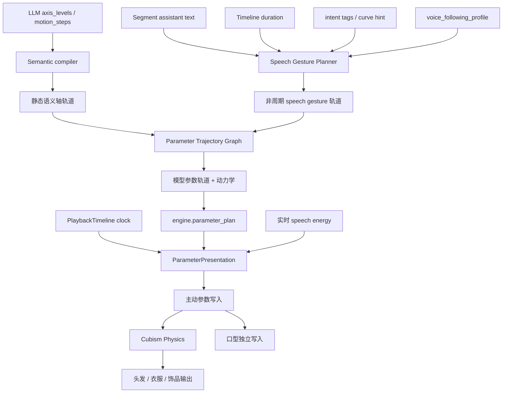

# 动作表现优化实施方案

本文针对 [当前动作与播放问题清单](./14-当前动作与播放问题清单.md) 中确认的八项问题，给出基于当前源码的实施方案。

目标不是再叠加一套动作系统，而是把现有 `ModelEngine -> engine.parameter_plan.v2 -> ParameterPresentation -> Cubism Physics` 主链继续做完整。实施时应删除被替代的固定模板和旧分支，不保留两套并行实现。

## 1. 目标与非目标

### 1.1 目标

- 普通对话不再表现为“一个静态姿态加固定摆动”。
- 说话动作由确定性的非周期事件组成，能够表达分句、停顿、重音和句尾。
- 视线、头部、身体具有明确的先后关系和不同响应速度。
- 主动参数平滑与头发、衣服、饰品的 Cubism Physics 保持分离。
- 同一个动作从 LLM 输出、九级采样、关系约束、参数轨道到最终播放均可在 Motion Lab 中追踪。
- 所有动作仍由现有 `PlaybackTimeline` 时钟驱动，不新增 wall clock、动作 timer 或第二个播放器。

### 1.2 非目标

- 不让大模型直接生成 Live2D parameter id 或逐帧数值。
- 不用更大的随机范围代替时间结构设计。
- 不在 WebSDK 中重新解释 `axis_levels`。
- 不让 performance curve 成为必需链路或阻塞 TTS。
- 不通过默认动作、静默降级或旧实现 fallback 掩盖编译错误。
- 不对 `Phy*`、头发、衣服和饰品输出应用主动参数平滑。
- 第一批优化不升级公开协议；只有明确改变协议语义时才升级 schema。

## 2. 当前源码中的真实数据流

### 2.1 Prompt 与动作意图

```text
AG99liveMotionPromptContributor
  -> system: Live2D Motion Decision
  -> capability: axes / resources / reference examples
  -> context: previous_motion
  -> Persona Effect ag99live.motion
  -> engine.motion_intent.v4
```

关键源码：

- `astrbot_plugin_ag99live_adapter/middleware/interaction_motion.py`
- `astrbot_plugin_ag99live_adapter/prompts/motion_selector_examples.py`
- `astrbot_plugin_ag99live_adapter/motion/motion_intent.py`

### 2.2 Segment 与时钟

`PlaybackTimelineSegmentJob` 已经同时包含：

```text
text.content
audio.url
motion.payload
turnId
messageId
```

但 `segmentJobExecutor.ts` 创建 `PlaybackTimelineMotionContext` 时，目前只传递身份、接收时间和 `timelineMode`，没有把 `text.content` 交给 ModelEngine。

音频 metadata 提供 duration 后：

```text
playbackTimelineRuntime.markAudioTimelineDuration()
-> onAudioTimelineDurationReady
-> motionEngine.preparePlaybackTimeline()
-> prepareSemanticMotionPayload() / prepareSpeechOnlyMotionRequest()
-> compileMotionIntent()
```

因此动作在音频开播前完成编译，但当前编译器只能看到 duration、motion intent 和模型 profile，看不到当前字幕文本，也看不到整段音频能量分布。

### 2.3 ModelEngine 编译

```text
Semantic phase
  IntentValidator
  -> AxisResolver
  -> IntensityStage
  -> CouplingStage
  -> ModeResolverStage
  -> TimingStage
  -> SemanticAxisRelationGraph

Model parameter phase
  SpeechPoseStage
  -> ModelParameterBindingStage
  -> ResourcePolicyStage
```

`SpeechPoseStage` 生成 `pendingSpeechGestures`，随后 `ModelParameterBindingStage` 将语义姿态和 speech gesture 合并为 `engine.parameter_plan.v2`。

### 2.4 WebSDK 逐帧执行

```text
Cubism Motion / idle
-> blink / expression / drag / breath
-> applyDirectParameterPlanOverlay()
-> CubismPhysics.evaluate()
-> lip sync
-> pose
-> model.update()
```

这个顺序意味着语义头身参数可以在同一帧驱动 Physics，Physics 输出又不会被普通参数平滑覆盖。这个顺序应保留。

## 3. 目标结构



其中：

- LLM 决定语义内容，不决定逐帧节奏。
- Speech Gesture Planner 决定说话期间的非周期动作事件。
- Parameter Trajectory Graph 统一处理轨道之间的关系和参数映射。
- ParameterPresentation 只按 Timeline 逐帧求值和执行主动参数动力学。
- Cubism Physics 继续独立处理被动部件。

## 4. 方案一：向 ModelEngine 提供 segment 级说话上下文

这是后续说话表演优化的前置工作。

### 4.1 根因

当前 `PlaybackTimelineSegmentJob` 已拥有 canonical assistant text，但文本只被传给 subtitle sink。ModelEngine 的 `StartPayloadContext` 和 `CompileOptions` 没有该字段，所以 `SpeechPoseStage` 只能依赖 intent tags、duration 和四套模板。

### 4.2 处理方式

直接扩展现有内部上下文，不修改 WebSocket 协议，也不再创建一套平行的 performance context：

```ts
interface PlaybackTimelineMotionContext {
  // existing identity and timeline fields
  assistantText: string | null;
}
```

它必须跟随现有 segment 身份，不建立独立 store：

```text
PlaybackTimelineSegmentJob.text.content
-> PlaybackTimeline entry.assistantText
-> audio duration ready callback
-> ModelEngine StartPayloadContext
-> CompileOptions
-> SpeechPoseStage
```

具体修改边界：

1. `segmentJobExecutor.ts`
   - 调用 `startAudioSink()` 时一并传入 `job.text.content`，不能等音频 sink 启动后再补写。
   - motion-only 时直接把同一字段放入 `PlaybackTimelineMotionContext`。
2. `playbackTimelineRuntime.ts`
   - 扩展现有 `PlaybackTimelineEntry`，保存只读 `assistantText`。
   - `prepareAudioTimeline()` 必须在调用 audio sink 的 start callback 前完成该字段写入。这样即使媒体 metadata 很快到达，duration-ready 回调也不可能先于文本上下文。
   - duration-ready 回调同时提供 `assistantText`，但不把文本塞入 `PlaybackTimelineSnapshot`；snapshot 继续只表达时钟与 sink 生命周期。
3. `app/playbackTimelineWiring.ts`
   - 将 `assistantText` 与 `projectMotionPlaybackClock()` 一起交给 `preparePlaybackTimeline()`。
4. `model-engine/runtime/contracts.ts`、`motionStart.ts`、compiler contracts
   - 逐层传递 `assistantText`，不新增全局变量或按 messageId 再查一次 SessionStore。
   - `ModelEnginePlanStartedEvent` 携带同一字段，保证播放记录使用的也是当前 segment 文本。
5. `useMotionPlaybackRecorder.ts`、`turn-playback/ports.ts`、`app/usePetDesktopRuntime.ts`
   - Recorder 改读 `event.assistantText`。
   - 删除只为动作历史提供的 `MotionPlaybackRecordPort.getLastAssistantText()` 以及对应全局 adapter state 读取。

### 4.3 为什么这样处理

- 文本、音频和动作仍来自同一个原子 segment。
- speech-only 动作也能得到同一字幕文本，而不是只让正式 motion payload 可用。
- Timeline snapshot 不被业务文本污染，时钟契约保持纯粹；文本只存在于当前 segment 的内部执行上下文。
- 不需要 Adapter 新协议，也不需要 AstrBot 重复发送文本。

### 4.4 明确删除或禁止

- 不允许在 `SpeechPoseStage` 直接读取 Vue store。
- 不允许建立 `Map<messageId, assistantText>` 作为第二份长期状态。
- 不允许从当前 UI 显示文本反查，因为它可能已经切换到下一段。
- 不保留 `getLastAssistantText()` 作为兼容路径；否则新旧两个文本来源会继续争夺记录所有权。

## 5. 方案二：用非周期手势规划器替换固定模板

对应问题 2.1、2.2 和 2.3。

### 5.1 需要删除的现有实现

完成迁移后，从 `speechPoseStage.ts` 删除：

- `GESTURE_TEMPLATES`
- `PRESET_CHANNELS`
- 将固定模板按整段 duration 等比拉伸的 `buildGestureTrack()`
- 只按固定通道顺序截取两个头部通道和一个身体通道的选择逻辑

旧模板不能作为 fallback 保留。新规划器编译失败时应返回结构化失败原因，而不是退回旧模板。

### 5.2 保留的现有契约

第一批继续输出当前 `speech_gesture_track`：

```ts
{
  preset,
  amplitudeRatio,
  delayMs,
  points: [{ at_ms, transition_ms, value }]
}
```

因此第一批不需要升级：

- `engine.motion_intent.v4`
- `engine.parameter_plan.v2`
- `ag99.voice_following_profile.v3`

变化发生在控制点如何生成，而不是传输形状。

### 5.3 新规划器输入

```text
turnId + messageId
assistantText
intentTags
performanceCurveHint（可选）
durationMs
SemanticAxisProfile
voice_following_profile.v3
```

所有随机选择继续使用稳定 seed。禁止每帧 `Math.random()`。

### 5.4 文本分句与时间槽

先将 assistant text 按以下边界分成 phrase：

```text
强边界：。！？!?\n
中边界：；;：:
弱边界：，、,
```

根据各 phrase 的有效字符数分配时间权重，再映射到已知 audio duration。这里不是重新建立时钟，只是在同一个 Timeline duration 内生成控制点。

规划约束建议：

| 语音长度 | 主要手势事件数 | 说明 |
| --- | ---: | --- |
| `< 700ms` | 0-1 | 短确认不强行摆动 |
| `700-1800ms` | 1-2 | 一个起势和一次收势 |
| `1800-4000ms` | 2-4 | 随分句改变重心 |
| `> 4000ms` | 每 0.8-1.8 秒一个候选 | 必须包含保持段，不能持续往返 |

事件间隔不能固定。使用稳定 seed 在合法区间内选择，但必须受 phrase 边界约束。

### 5.5 手势事件族

规划器不直接选择 parameter id，只选择语义事件族：

```text
weight_shift       yaw / roll 主导的重心变化
tilt_hold          歪头后短时保持
nod_accent         稀疏 pitch 点头
gaze_shift         小幅视线转移
forward_emphasis   强调时前倾
settle             句尾回收 speech offset
```

选择原则：

- 普通解释以 `weight_shift` 和 `tilt_hold` 为主。
- `nod_accent` 只用于强调、确认或明确句尾，不作为默认循环动作。
- 疑问句尾优先 `gaze_shift + tilt_hold`。
- 调侃可以使用一次较快的 lateral shift，但后续必须保持或换动作族。
- 同一段中不得连续三次使用同一事件族。
- 连续两段回复应读取上一动作摘要，避免相同主轴、相同方向和相同事件族同时重复。

### 5.6 头、身体与视线轨道

头部先生成主事件，身体和视线从主事件派生：

```text
视线：可提前 60-140ms
头部：主事件时间
身体：使用 voice_following_profile.follow_delay_ms 延迟
身体幅度：使用 amplitude_ratio 和 semantic axis speech offset 上限
```

身体允许两种模式：

- 同向跟随：普通解释和开心摆动。
- 有限反向平衡：方向反转或强侧倾时使用，幅度必须小于头部。

第一批仍由 planner 生成这些派生轨道。等时间关系图完成后，应把 delay、比例和反向平衡移交给图，planner 只输出主事件。

### 5.7 实时 RMS 的新职责

当前 RMS 不应继续成为主要动作幅度来源。目标职责是：

- 普通发声：对计划动作做小范围活跃度调节。
- 能量峰值：轻微提高当前 emphasis，不改变方向。
- 短暂停顿：降低变化速度或保持当前 speech offset。
- 长静音：停止产生新的 speech gesture 变化，但不把语义基础姿态拉回 neutral。

第一批应先降低当前 `SPEECH_AUDIO_GAIN_FLOOR/SPAN/MAX` 对轨迹幅度的支配程度，并删除“静音仍以 0.32 倍持续摆动”的行为。

不能简单把 gain floor 改成 0，因为那会在停顿时把 speech offset 拉回静态姿态。正确处理是让 pause 进入“保持当前 speech target”状态，恢复发声后再跟随同一个 Timeline 上后续控制点。

该状态仍由 WebSDK 的逐帧 presentation 消费真实 RMS，不建立第二个 elapsed time。

### 5.8 失败与诊断

建议新增明确原因：

```text
speech_performance_text_missing
speech_performance_duration_invalid
speech_performance_channel_unavailable:<family>
speech_performance_track_invalid:<axisId>
speech_performance_track_not_monotonic:<axisId>
```

Motion Lab 记录：

```text
phrase boundaries
selected gesture families
seed
selected channels
head/body/gaze delays
generated control points
energy policy
```

## 6. 方案三：补充面部和视线的说话层次

对应问题 2.3。

### 6.1 当前限制

`VOICE_FOLLOWING_CHANNEL_SPECS` 当前只扫描：

```text
head_yaw / head_pitch / head_roll
body_yaw / body_pitch / body_roll
```

说话手势不会主动生成 gaze 轨道。眼睛开合仍由 Cubism blink、expression 和 LLM 静态语义姿态负责。

### 6.2 处理方式

在不争夺 blink 所有权的前提下，扩展 voice-following capability：

- 允许 `gaze_x`、`gaze_y` 作为 `layer=gaze` 的可选 channel。
- 只在模型 SemanticAxisProfile 中存在可绑定 gaze 轴时生成。
- gaze 幅度使用独立、较小的 `max_speech_offset_ratio`。
- gaze 可以先于 head yaw，但不能持续高频扫视。
- 不把 `eye_open_left/right` 纳入 speech gesture；眨眼仍由 Cubism blink 或 expression 所有。
- brow 和 mouth smile 仍由 LLM 语义姿态或 expression resource 所有，第一批不增加自动眉毛循环。

`VoiceFollowingChannelProfile.layer` 当前类型已经允许字符串，channel map 也允许新增能力，因此只增加 gaze channel 不需要改变 V3 数据结构。扫描器、校验器和 Prompt 摘要需要同步认识该 channel。

## 7. 方案四：扩展为真正的参数轨道关系图

对应问题 2.5。

### 7.1 分清两个图

项目需要保留两个不同层次：

1. **语义值关系图**
   - 当前 `ag99.semantic_axis_relation_graph.v1`。
   - 负责九级值转换后的静态 derive 和 bounded ratio。
2. **参数轨道关系图**
   - 负责轨道的 delay、follow、counterbalance、mix 和动力学策略。
   - 输入是已经合法的语义轴轨道，输出是模型参数轨道。

不能把这两个图混成一个巨型 stage。第一个处理“值是多少”，第二个处理“值如何随时间到达模型”。

### 7.2 轨道图节点

建议的最小节点集合：

```text
source_pose       静态 axis_levels 姿态
source_sequence   motion_steps 语义关键帧
source_speech     speech gesture 控制点
delay             头身或视线时间偏移
scale             相对幅度
counterbalance    有限反向平衡
sum               同一语义轴多个合法轨道合成
range             semantic axis / parameter 硬范围
binding           语义轴到模型参数映射
dynamics          参数响应策略
```

### 7.3 所有权

```text
Speech Gesture Planner：生成主手势事件
Parameter Trajectory Graph：派生头身/视线轨道并解决冲突
ModelParameterBindingStage：执行最终 binding
ParameterPresentation：逐帧求值
Cubism Physics：被动参数物理
```

迁移完成后，应删除 `SpeechPoseStage` 内重复的头身比例和 delay 派生逻辑，避免 planner 和图同时控制身体。

### 7.4 第一版不要做的内容

- 不做可执行脚本语言。
- 不允许 UI 任意连接未校验节点。
- 不在每帧遍历复杂动态对象图；编译阶段先把图化简为 parameter tracks。
- 不把 Physics 粒子节点混入主动参数轨道图。

### 7.5 Schema 影响

只要时间关系仍是 ModelEngine 内置规则，公开 schema 可以不变。

如果后续要把 temporal edge 保存到每个模型 profile，则必须原子升级：

```text
ag99.semantic_axis_relation_graph.v1 -> v2
ag99.semantic_axis_profile.v2 -> v3
```

Adapter manifest、Python 校验、frontend generated constants、Profile Editor 和 model sync 必须同一批更新，不能只改一端。

## 8. 方案五：替换过于干净的主动参数动力学

对应问题 2.6。

### 8.1 当前实现应如何迁移

`ParameterPresentationNode` 当前持有：

```text
drivenValue
velocity
lastElapsedMs
maxVelocity
maxAcceleration
```

第一步不增加 profile 字段，先在现有 `maxVelocity + maxAcceleration` 约束内实现更自然的分段动力学：

- 启动阶段限制加速度变化，避免每帧立即使用最大 acceleration。
- 方向反转先制动，再进入反向加速。
- head、body、gaze 使用基于 semantic group 的响应策略。
- 到达目标后允许极小、有限时长的残留，但不能无限振荡。
- release 阶段继续与当前 Cubism Motion/Expression base value 混合，最终帧必须严格等于 base value。

完成后删除旧 `advanceParameterDynamics()`，不要保留“新 solver 失败就调用旧 solver”的分支。

### 8.2 参数边界

主动参数 solver 只处理 SemanticAxisProfile 的 bindable parameter：

```text
head
body
gaze
mouth / brow / expression-compatible axis
```

以下参数禁止进入：

```text
Phy*
physics / marker 分类
Cubism Physics terminal outputs
```

### 8.3 后续 profile 扩展

如果真实模型调校证明仅有 max velocity/acceleration 不够，再升级 dynamics：

```json
{
  "max_velocity": 220,
  "max_acceleration": 1200,
  "response_frequency_hz": 3.2,
  "damping_ratio": 0.82,
  "max_speech_offset_ratio": 0.16
}
```

这会改变 `ag99.semantic_axis_profile`，应与关系图 profile 升级合并进行，避免连续升级多个版本。

### 8.4 验收重点

- 30、60、120 FPS 输入下，相同 Timeline 时间应得到近似相同的位置。
- 方向反转不出现跳变或长时间贴边。
- 动作结束与 idle motion 混合连续，最终释放值等于当帧 base value。
- body 比 head 更慢但不能明显拖到下一句。
- Physics 输出不经过该 solver。

## 9. 方案六：分阶段处理 `motion_steps` 灵活性

对应问题 2.4。

### 9.1 V4 阶段

先保留 V4 的“所有步骤相同轴集合”规则，原因是当前 `compileModelParameterPlan.ts` 依赖闭合的 parameter set 生成 keyframe。

在 V4 内可以先改进：

- 增加普通对话的自然 sequence 示例。
- Prompt 明确 motion_steps 用于“语义姿态变化”，speech gesture 用于普通说话节奏。
- 示例覆盖惊讶后回收、疑问句尾歪头、解释中途改变重心，而不只覆盖用户命令的左右看。
- Motion Lab 完整保存并编辑每一步，而不是压平。

### 9.2 稀疏步骤需要 V5

如果允许每一步使用不同轴集合，必须先定义省略语义：

```text
省略轴：保持上一步目标和所有权
显式 0：回到该轴 neutral
首次出现：从当帧 base / neutral 进入控制
最后不再出现：不能自动释放，必须由明确规则决定
```

这与 V4 当前“每步闭合轴集合”语义不同，因此应升级为 `engine.motion_intent.v5`，不能在 V4 内悄悄改变解释。

V5 编译器需要：

1. 收集所有步骤轴集合的 union。
2. 逐步执行 carry-forward。
3. 对显式 `0` 生成 neutral keyframe。
4. 在参数绑定后验证每个 parameter track 闭合。
5. 删除当前对 semantic-axis missing parameter 的无条件 mismatch 拒绝。
6. Motion Lab 同时记录原始 sparse steps 和展开后的闭合轨道。

## 10. 方案七：Physics 先诊断，再增加模型级调校

对应问题 2.7。

### 10.1 当前倍率的准确含义

`CubismPhysics.updateOutputParameterValue()` 当前先计算 Physics 输出，再执行：

```text
scaled = valueBeforePhysics
       + (valueAfterPhysics - valueBeforePhysics) * responseScale
```

因此 `physicsResponseScale` 只改变末端输出幅度，不改变粒子速度、delay、mobility 或 acceleration。设置为 2 后看到摆幅变大是预期行为，但它不会自动变得更灵动。

### 10.2 第一阶段：建立 Physics 图和诊断

Adapter scanner 读取 `.physics3.json` 时补充结构化摘要：

```text
setting index / name
input parameter ids + weights + reflect
particle count
Mobility / Delay / Acceleration / Radius
output parameter ids + weights + scale + reflect
哪些 output 又被其他 setting 当作 input
哪些 output 是 terminal
```

WebSDK 只在 Motion Lab 诊断开启时，以低频聚合方式记录：

```text
本帧语义驱动输入
Physics setting 输入
原始 Physics 输出
terminal scale 后输出
clamp 次数
```

禁止默认逐帧 `console.log`，否则会影响渲染并淹没真正错误。

### 10.3 第二阶段：模型级 Physics presentation profile

只有真实日志证明不同 Physics setting 需要不同表现时，再增加模型 profile：

```json
{
  "schema_version": "ag99.physics_presentation_profile.v1",
  "groups": {
    "hair_front": { "response_scale": 1.2 },
    "hair_back": { "response_scale": 1.35 },
    "clothing": { "response_scale": 1.1 }
  }
}
```

第一版只做 per-group terminal response scale，不在线修改原模型 particle 参数。`Mobility/Delay/Acceleration/Radius` 属于模型物理解算本身，除非有明确模型级校准数据，否则不应由一个全局 UI slider 重写。

### 10.4 保留边界

- 继续保证 Physics input parameter 不受 terminal scale 影响。
- 继续在 direct parameter plan 之后执行 `CubismPhysics.evaluate()`。
- 不使用随机头发摆动补充物理。
- 不通过提高渲染 FPS 改变物理速度；delta time 必须保持真实。

## 11. 方案八：完成 Motion Lab 数据闭环

对应问题 2.8。

### 11.1 sequence 样本不能再压平

当前 `MotionTuningStore.refresh_reference_examples()` 总是读取 `adjusted_axes` 并生成单一 `axis_levels`。应改为：

```text
compiled motion kind=pose
  -> axis_levels

compiled motion kind=sequence
  -> motion_steps
  -> 保留每步 axis levels 和 duration weight
```

不再新增 `raw_motion_steps`、`adjusted_motion_steps` 这类与现有编译结果重复的顶层字段。当前 `CompiledSemanticMotion` 已经具备：

```text
kind=sequence
steps[].durationWeight
steps[].axes
steps[].diagnostics.transformTrace.rawAxisLevels
steps[].diagnostics.transformTrace.resolvedAxes
steps[].diagnostics.transformTrace.constrainedAxes
```

应直接把 sequence-aware 的 `compiled_semantic_motion` 作为人工调整结果的事实源。`adjusted_axes` 只保留为 pose 样本的 UI 摘要，不能再作为所有样本必填且不能参与 sequence 的 Prompt 投影。`source_record_id` 继续标识前端播放记录，原始动作则通过该记录的 `turn_id + message_id` 关联 Motion Lab raw event，不把同一序列复制成第二套样本字段。

不能只从最终 parameter value 反推九级；原始等级必须读取原始 intent 或每步 transform trace。保存动作时若原始事件或 per-step trace 缺失，应明确拒绝该 sequence 样本，而不是根据最终值猜测。

### 11.2 保存最小对话上下文

样本只保存紧邻的：

```json
{
  "user_text": "当前用户输入",
  "assistant_text": "当前 assistant 输出"
}
```

不保存 system prompt、工具调用、完整 MessageChain 或协议载荷。`turn_id + message_id` 只用于关联，不作为 Prompt 示例文本。

当前 `turn_coordinator.py` 已分别写入 `turn.input_received` 和 `turn.assistant_output`，`motion_lab_raw_events` 也已经有 `turn_id`、`message_id`、`user_text`、`assistant_text` 字段及 turn/segment 索引。不过 `MotionLabRawEventStore` 当前只有 append，没有读取接口。

处理时应给现有 store 增加一个受限查询：按 `turn_id` 读取该轮最近的 `turn.input_received` 和目标 `message_id` 的 `turn.assistant_output`。`MotionTuningStore` 保存样本时通过这个查询填充上下文；前端只提交 `source_record_id + turn_id + message_id`，不能从 UI 当前显示文本猜测，也不应把完整聊天历史重新塞进保存协议。

### 11.3 用户样本按当前语义选择

当前 `resolve_motion_reference_examples()` 使用列表前 N 条用户样本。应拆分 Prompt 层：

- capability：保留轴定义和少量固定结构示例。
- context：根据当前用户输入选择 1-3 个相关人工样本。
- previous motion：继续只携带上一动作关键轴和动作族。

当前 `AG99liveMotionPromptContributor.collect()` 已经拿到 event，但 `_build_motion_runtime_payload()` 立即丢弃 event。应使用当前 user text 做轻量、确定性的相关性排序：

```text
标签精确匹配
用户文本关键词匹配
assistant 文本关键词匹配
相同模型/profile
人工启用状态
最近使用惩罚
```

第一版不需要 embedding 或额外小模型。没有相关样本时只使用固定结构示例；这不是动作 fallback，而是 Prompt 本来就允许没有人工样本。

### 11.4 动作多样性记录

除上一动作外，保留最近有限窗口的摘要：

```text
主动作族
主轴
方向
是否 sequence
是否使用 resource
```

只把压缩后的重复信息放入 Prompt，例如：

```text
最近三段已连续使用 head_roll 正方向，本轮在语义允许时优先改变主轴或方向。
```

它是生成约束，不在 Adapter 内改写模型已经输出的合法动作。

## 12. Prompt 优化同步方案

当前 V4 已支持的同轴 `motion_steps` 选择规则和自然 sequence 示例可以先调整；涉及分句时间、停顿、重音和 speech gesture 的 Prompt 信息必须等非周期 planner 完成后再加入，避免要求执行端尚不支持的能力。

### 12.1 system

只保留：

- 每个 assistant segment 恰好一个 motion effect。
- `axis_levels` 与 `motion_steps` 的选择规则。
- 九级语义和省略/0 的区别。
- 资源层所有权。
- 普通主姿态从三级开始，四级用于短时夸张。

### 12.2 capability

只保留：

- 当前模型可用轴及语义。
- character motion style。
- 固定结构示例。
- 已筛选 resource candidates。

### 12.3 context

只保留：

- 上一动作摘要。
- 最近动作族重复摘要。
- 与当前用户输入最相关的人工样本。

### 12.4 示例调整

至少增加三类自然 sequence：

1. 解释：侧向进入 -> 转折时换重心 -> 句尾保持。
2. 疑问：先看向用户 -> 句尾歪头并改变 gaze。
3. 惊讶：快速后缩 -> 短暂停留 -> 回收到仍然警觉的姿态。

示例仍只输出语义轴，不包含 speech gesture 控制点。说话节奏属于 ModelEngine，不应由大模型逐帧描述。

## 13. 实施批次

### 批次 A：segment performance context

- 打通 assistant text 到 ModelEngine 的内部链路。
- 不改公开协议。
- Motion Lab 记录 planner 输入文本摘要。

完成标准：正式 semantic motion 和 speech-only motion 都能拿到同一 segment 文本。

### 批次 B：非周期 Speech Gesture Planner

- 删除四套固定模板及固定通道截取逻辑。
- 生成 phrase-aware、duration-aware 的稳定控制点。
- 保持 `speech_gesture_track` 形状。
- 增加 gaze channel capability。

完成标准：相同 segment 可复现；不同长度和不同标点的文本得到不同控制点数量与保持位置。

### 批次 C：实时 energy 语义和主动参数动力学

- 删除静音仍持续固定幅度摆动的 gain 设计。
- 实现 pause hold 和小范围 emphasis。
- 用新动力学替换 `advanceParameterDynamics()`。
- 保证 release 最终等于 base value。

完成标准：真实停顿不继续往返摆动，方向反转和动作尾部无跳变。

### 批次 D：Prompt 与 V4 sequence 示例

- 已完成：普通对话存在明确姿态变化时允许 motion_steps。
- 已完成：在不增加示例总数的前提下，加入解释换重心、疑问句尾侧倾和惊讶回收 sequence。
- 待完成：结合 Motion Lab 数据闭环动态选择相关人工样本。

完成标准：模型不再只在用户明确下动作命令时使用 sequence，且不会把 speech rhythm 写进 motion_steps。

### 批次 E：参数轨道关系图

- 把 delay、scale、counterbalance 从 planner 收口到轨道图。
- 编译阶段生成闭合 parameter tracks。
- 删除重复头身派生逻辑。

完成标准：每类关系只有一个所有者，Motion Lab 能显示每条 temporal edge 的输入和输出。

### 批次 F：Physics 诊断和模型调校

- 扫描 Physics 图。
- 增加按需诊断。
- 根据 Mk6 实测决定是否增加 per-group profile。

完成标准：能够回答某个头发末端参数由哪个输入、setting 和 particle 链驱动，以及幅度在哪一层被削弱。

### 批次 G：Motion Lab sequence 闭环

- sequence 编辑、重放、保存和 Prompt 投影全程保留步骤。
- 复用 `compiled_semantic_motion.steps`，删除 `adjusted_axes` 对 sequence 的错误所有权，不新增重复 steps 字段。
- 通过现有 raw event store 的 turn/segment 索引保存一组 user/assistant 上下文。
- 增加相关样本选择和最近动作族摘要。

完成标准：人工认可的一段 sequence 可以原样回到 Prompt，并能从原始等级追踪到播放终态。

### 批次 H：稀疏 sequence 协议

- 仅在 V4 和轨道图稳定后评估。
- 需要时升级 `engine.motion_intent.v5`。
- 不与前面质量优化混在同一个提交中。

## 14. 验收方式

自动测试只做最基础的输入输出 smoke，不把测试结果当作动作效果证明。

### 14.1 最小静态检查

- TypeScript typecheck。
- Python 修改文件 syntax/compile 检查。
- schema manifest 一致性检查，仅在 schema 变化时执行。
- 一个稳定 seed 输入应生成相同控制点。
- 一个非法 track 输入应得到明确 failure reason。

### 14.2 必须进行的真实观察

使用同一个 Mk6 模型验证：

1. 500ms 左右短确认。
2. 2-3 秒普通解释。
3. 6 秒以上包含逗号、转折和句号的长句。
4. 明确疑问句。
5. 明确惊讶或强调句。
6. 包含真实静音停顿的 TTS。
7. 连续三轮相似语义回复。
8. semantic motion + speech 与 speech-only 各一段。

每段同时观察：

```text
Prompt motion effect
compiled semantic motion
speech gesture events
parameter plan
Timeline clock
WebSDK parameter writes
Physics terminal outputs
Motion Lab terminal outcome
```

### 14.3 视觉验收标准

- 普通说话不出现固定节拍的左右循环。
- pitch 点头是稀疏强调，不是默认动作。
- 长句的手势事件比短句多，但包含明显保持段。
- 头先动、身体后跟，身体幅度通常小于头部。
- gaze 变化短促且有目的，不持续扫视。
- 停顿时保持重心，不突然回正，也不继续大幅摆动。
- 动作结束后与 idle motion 连续混合。
- 头发和衣物响应来自 Cubism Physics，而不是主动参数随机扰动。

## 15. 实施纪律

- 每个批次先删除被替代逻辑，再接入新逻辑。
- 不增加“新逻辑失败则调用旧模板”的兼容分支。
- 不把诊断 warning 当成功终态。
- 不把动作观感问题通过扩大所有 range 统一解决。
- 不因缺少真实 Live2D 验证而增加更多 mock 或组合测试。
- 每批完成后先做源码链路复核，再进行一次真实 Electron + TTS + Live2D 对话观察。
- schema 升级必须 Adapter、manifest、frontend parser、generated constants 和文档原子完成。
