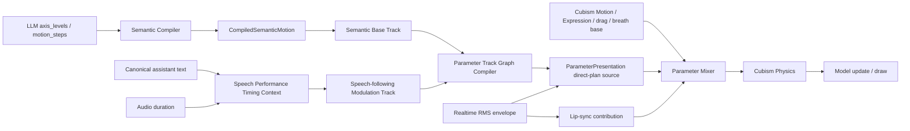

# 动作表现优化实施方案

本文定义当前源码基础上的后续实施路线。顺序是先补齐说话表演的时间结构，再统一参数轨道和
主动动力学，最后建立 Physics 调校与 Motion Lab 深化能力。

问题依据见 [当前动作与播放问题清单](./14-当前动作与播放问题清单.md)。

## 1. 目标与边界

目标：

- 让长短句、停顿、重音、转折和句尾产生不同的说话动作结构。
- 让语义姿态、说话手势、视线、面部、主动动力学和 Cubism Physics 各有明确所有者。
- 保持主模型 `axis_levels` / `motion_steps` 是唯一语义动作来源；文本分句、音频时长和 RMS
  只安排或调制补充的说话随动。
- 最终把各 source 已计算出的主动参数贡献交给 Parameter Mixer，形成唯一最终参数帧，再交给 Cubism Physics。
- 保持 `turn_id + message_id`、统一 Timeline 时钟和严格失败语义不变。
- 让 Motion Lab 能解释每个阶段的输入、变换和最终计划。

非目标：

- 不启用 `parallel_independent`，仍由同一 Persona 回复同时生成文本和 effect call。
- 不让 LLM 直接输出逐帧数组、Live2D 参数值或 Physics 粒子参数。
- 不建立第二个音频时钟、墙钟动作 timer 或独立播放器。
- 不用默认动作、旧协议或 speech-only 掩盖正式动作失败。
- 不为了兼容开发期历史数据保留旧 schema 和旧样本转换器。

## 2. 当前已落地基线

### 2.1 协议与两阶段编译

```text
engine.motion_intent.v4
  -> semantic compile
  -> CompiledSemanticMotion
  -> model_parameter compile
  -> engine.parameter_plan.v2
```

- v4 使用九级 `axis_levels: -4..4` 或 2-4 步同轴集合 `motion_steps`。
- Adapter 只做协议、当前模型能力和资源校验。
- ModelEngine 负责等级采样、强度、关系图、timing 和参数绑定。
- 手动预览保存 `CompiledSemanticMotion`，直接进入第二阶段，不重走 LLM 协议。

### 2.2 动作、TTS 与可选曲线的真实时序

```text
主模型一次回复
-> assistant text + exactly one ag99live.motion effect
-> TTS 开始
-> optional performance curve 与 TTS 并行
-> output.segment.v3 原子携带 text + audio + motion
-> 前端拿到真实 audio duration
-> 按 duration_weight 编译并展开已存在的语义动作
```

- TTS 只生成音频事实和时长，不生成语义动作。
- performance curve 只返回整段 timing/energy hint，不返回 axis 或逐句动作。
- `motion_steps` 当前没有 phrase index 或 text span，因此只能按权重与整段音频近似对齐。

### 2.3 Prompt 与参考样本

- system 只描述任务、选择原则和输出要求。
- capability 提供当前 profile 轴定义、九级语义和固定结构示例。
- context 提供本轮输入、上一动作关键轴和按本轮语义选中的人工样本。
- 普通解释、疑问句尾和惊讶回收已有自然 sequence 示例。
- 人工样本按当前用户文本、标签和动作族做轻量确定性排序。
- pose 与 sequence 样本均保留原始编译结构，不再压平。

### 2.4 播放与完成门禁

- 有音频时只使用本段 `HTMLAudioElement` 时钟。
- semantic motion 与 speech-only 共用 PlaybackTimeline。
- SessionStore 保存协议槽位和稳定投影，Timeline 保存 required sink 实时状态。
- 下一段和 `control.playback_finished` 都会等待开放 required Timeline 结束。
- `motion.failed` 不会被 speech-only 或默认姿态替代。

### 2.5 主动参数与 Physics 边界

- ParameterPresentation 在 Cubism Physics 之前驱动主动参数。
- Physics 在主动参数写入后求值，不经过语义轨迹平滑。
- `physicsResponseScale` 只放大末端 Physics 输出。
- Physics input 和 SemanticAxisProfile 已绑定的主动姿态参数不受该倍率影响。

## 3. 目标结构



职责：

| 层 | 负责 |
| --- | --- |
| LLM | 整句语义方向、九级强度、少量语义姿态步骤 |
| Semantic Compiler | profile 校验、等级采样、静态轴关系和语义约束 |
| Speech Performance Timing Context | 只输出分句、时长槽、停顿/重音窗口，不输出语义轴方向 |
| Parameter Track Graph Compiler | 以 LLM 语义轨道为基座，叠加有界说话调制、头身延迟和 hold/release |
| ParameterPresentation | 单一 direct plan source 的帧率无关轨迹与主动参数动力学 |
| Parameter Mixer | 读取 Cubism base snapshot，统一组合 source contribution，裁剪并形成唯一最终参数帧 |
| Cubism Physics | 头发、衣服、饰品等被动响应 |

## 4. 已完成：打通 segment performance context

### 4.1 根因

`PlaybackTimelineSegmentJob.text.content` 是当前 segment 的 canonical assistant text。该文本
现在作为只读执行事实进入 ModelEngine，而不是通过全局字幕、最后回复或另一张文本表反查。

### 4.2 修改方式

沿现有执行调用链传递只读文本：

```text
PlaybackTimelineSegmentJob.text.content
-> PlaybackTimelineMotionContext.assistantText
-> InboundPayloadContext
-> PendingInboundMotionPayload
-> StartPayloadContext
-> CompileOptions.assistantText
-> SpeechPoseStage
```

speech-only 没有正式 motion payload context，因此 Timeline wiring 使用同一个 SessionStore getter
按 `turn_id + message_id` 读取已提交文本，再显式传给 prepare/start。预编译缓存同时绑定文本内容，
不会把同一身份下的旧文本计划误用于新文本。

约束：

- 文本只属于当前 segment 内部执行上下文，不加入外部 WebSocket schema。
- 不把业务文本塞进 `PlaybackTimelineSnapshot`；snapshot 继续只表达时钟和 sink 状态。
- 不建立 `Map<messageId, assistantText>` 或从全局最后字幕反查。
- speech-only 与 semantic motion 必须得到同一份文本。
- 任何层发现身份不匹配都应失败，不从 SessionStore 猜测其它 segment。
- 文本上下文只服务说话随动的时间窗口；不将 phrase 数量猜成 `motion_steps`，
  不生成 axis level，不改写 LLM 已给出的语义方向。

### 4.3 分句输出

第一版使用确定性标点与长度规则，不引入新 NLP Provider：

```text
。！？!?；;
-> strong phrase boundary

，、,:：
-> soft phrase boundary

过长片段
-> 按字符上限切成可控 phrase
```

输出只包含规划所需事实：

```ts
interface SpeechPhrase {
  text: string;
  boundary: "strong" | "soft" | "none";
  weight: number;
  emphasis: number;
}
```

phrase 有效字符权重映射到同一 audio duration，不创建新时钟。过长片段按 18 个有效字符切分；
连续标点合并到相邻 phrase。文本为空是合法 audio-only 情况，此时生成一个 duration-only phrase，
不是协议修复或 fallback。

## 5. 已完成：用非周期说话调制替换固定模板

### 5.1 删除范围

`speechPoseStage.ts` 中以整段拉伸为核心的以下实现已经删除：

- `GESTURE_TEMPLATES`。
- 固定 preset 控制点。
- 同组头身共用同一轨迹形状的构造方式。
- 仅按整段 hash 决定一次方向的逻辑。

保留 `ag99.voice_following_profile.v3` 的 channel、semantic axis、amplitude ratio 和 delay
契约；它继续描述模型能如何跟随，而不是描述整段动作模板。

### 5.2 规划事件

当前 direct-plan 契约最多容纳 8 个 modulation points。首点固定为零，尾点在本段结束前收势，
中间最多容纳 6 个 phrase gesture points。长文本会根据音频时长和通道层级确定性合并 phrase，
不会突破现有 `engine.parameter_plan.v2` 结构。

当前每个保留 phrase 生成一个确定性调制目标：

```text
gesture_window    允许 voice-following channel 进行一次非周期调制
emphasis_window   在已选通道上短时增强幅度或速度
settle_window     收窄调制并允许回收
```

事件不是逐帧随机。时间窗口、调制强度和方向变化使用
`turnId + messageId + channel + preset + phraseIndex + phraseText` 生成可复现的有界结果。
事件本身不包含独立 axis level，只在 LLM 已编译语义目标周围增加受 profile 限制的偏移。

基本节奏：

```text
准备 -> 起势 -> 移动 -> 短暂保持 -> 收势
```

长句按 phrase 增加调制窗口，短句保持简洁。疑问和感叹标点提高当前 phrase 的有限强调；
具体头身通道仍由 voice-following profile、LLM intent tags 和当前语义轨道共同限定。

### 5.3 头身视线关系

- head 是主要说话手势。
- body 使用 profile delay，事件密度低于 head，起势和过渡也更慢。
- 各 channel 使用独立种子和时间扰动，不再共享一条整段曲线形状。
- 句尾 modulation 回到零，语义基础姿态本身不被强制改写为 neutral。
- gaze lead、反向平衡和部位 residual 属于后续 parameter track graph，不在本批伪造。

调制器输出的是附着在语义轨道上的 speech-following modulation track，不是新的语义动作。
参数绑定仍由 `ModelParameterBindingStage` 唯一完成。

## 6. 已完成：RMS 静音收敛与短重音增益

RMS 不决定角色向左还是向右，只修正已经规划好的时间轨道：

```text
持续静音
-> pause hold

能量快速上升
-> emphasis pulse

正常发声
-> follow planned track

句尾能量下降
-> allow settle
```

`SpeechSignalRuntime` 现在使用 voiced/unvoiced 双阈值滞回。低于退出阈值后，目标能量明确为零，
头部和身体继续按各自 release 速度收敛；原有非零 gain floor 已删除。正能量斜率经过独立的快速
attack/release envelope 形成短促 emphasis gain，并继续受 head/body/pitch 现有限幅约束。

实时层只调整当前轨道幅度，不得每帧重新选择动作方向。
随机口型降级只写 mouth value，不能生成 speech energy 或头身事件。

## 7. 批次 D：建立参数时间轨道图

### 7.1 与语义轴关系图的区别

现有 `ag99.semantic_axis_relation_graph.v1` 解决同一时刻的值关系：

```text
head_yaw value -> body_yaw derived/bounded value
```

新的 parameter track graph 解决时间关系：

```text
head_yaw track
-> delayed body_yaw track
-> gaze_x lead track
-> release and residual policy
```

第一版不需要通用可视化图运行时。编译阶段使用 typed nodes 构建并化简为闭合
parameter tracks，逐帧阶段只消费数组和常量。

### 7.2 第一版节点

```text
semantic_pose_track
speech_gesture_modulation_track
delay
scale
bounded_ratio
blend
hold
release
residual
parameter_binding
```

约束：

- 同一参数每一时刻只有一个最终主动写入者。
- resource motion 与 parameter track 冲突时继续由 ResourcePolicy 决定替代或拒绝。
- 所有轨道必须在编译阶段验证 duration、keyframe 单调性和参数范围。
- 输出仍是 `engine.parameter_plan.v2`；内部图不跨 WebSocket。

## 8. 批次 E：升级主动参数动力学

ParameterPresentation 只处理主动参数，不处理 Physics 粒子。

按参数族配置：

| 参数族 | 目标特征 |
| --- | --- |
| gaze | 快速启动、短延迟、低残留 |
| head | 中等重量、允许轻微受控过冲 |
| body | 更慢启动、更长制动、更明显延迟 |
| face | 快速但避免闪变 |
| mouth | 由 lip-sync 独立控制 |

需要替换“越过目标立即归零”的统一规则，加入：

- jerk 或加速度变化限制。
- 有界 overshoot。
- reversal hesitation。
- residual decay。
- release 到当前 Cubism Motion/Expression base value。

必须保持：

- 使用 Timeline delta，不依赖显示器刷新率。
- 30、60、120 FPS 输入下轨迹近似一致。
- 最终释放值严格回到当前 base value，不跳到历史 target。
- Physics 输出参数不进入这套平滑。

## 9. 批次 F：Physics 诊断与模型级调校

### 9.1 先建立关系图

从 `.physics3.json` 和 Cubism runtime 解析：

```text
Physics setting
-> input parameters
-> normalization
-> particles
-> output parameters
-> terminal/non-terminal output
```

Motion Lab 诊断开启时低频记录：

- setting 输入范围和峰值。
- 粒子角度/位移摘要。
- 末端输出增量。
- clamp 次数。
- 响应峰值时间和衰减时间。

不做每帧全量日志。

### 9.2 模型级 profile

诊断成立后，再增加每模型 Physics presentation profile：

```text
setting_id
response_scale
mobility_scale
delay_scale
acceleration_scale
```

仍由 Cubism Physics 求解，不手工写头发、衣服或饰品参数。现有全局
`physicsResponseScale` 可以保留为总倍率，但必须继续排除 Physics input 和语义主动参数。

## 10. 批次 G：完成 Motion Lab 编辑与多样性反馈

当前数据链已经具备：

- canonical segment text。
- 同 Turn 用户输入/assistant 输出。
- pose/sequence `CompiledSemanticMotion`。
- parameter plan、transform trace 和终态。
- request-scoped 参考样本选择及选择结果记录。

后续只补：

1. sequence step 编辑器：逐步修改 `axis_levels`、`duration_weight`，并立即重编译预览。
2. 最近动作多样性摘要：记录有限窗口内的动作族、主轴方向和是否 sequence。
3. Prompt context 只注入紧凑分布摘要，不注入完整历史。
4. 数据导出在小模型训练阶段再做，不进入当前播放主链。

## 11. V4 与后续协议

当前 V4 保持 2-4 步同轴集合，避免在稳定协议里加入隐式稀疏语义。

只有真实样本证明需要后，再设计新版本：

```json
{
  "steps": [
    {
      "set": { "head_yaw": 3 },
      "hold": ["gaze_x"],
      "release": ["body_yaw"],
      "duration_weight": 2
    }
  ]
}
```

新版本必须同时定义：

- 省略轴、hold、inherit、release 的区别。
- 参数所有权如何闭合。
- 与 expression/motion resource 的冲突。
- Motion Lab 保存和回放格式。

不得让 V4 parser 猜测这些含义。

## 12. 实施顺序

```text
A  speech performance timing context            complete
-> B 非周期 speech-following modulation          complete
-> C silence/emphasis realtime gain              complete
-> D parameter track graph                       next
-> E active parameter dynamics
-> F Physics diagnostics/profile
-> G Motion Lab sequence editor/diversity
-> 有数据后再评估新 sequence 协议和动作小模型
```

批次 A-C 已保持现有 `engine.parameter_plan.v2`、PlaybackTimeline 和 WebSDK 时钟边界完成。
下一阶段 D-E 继续沿现有编译器和 ParameterPresentation 修改，不新增第二套轨道播放器。

## 13. 验收

最小静态检查：

- TypeScript 类型检查覆盖变更入口。
- 只检查一个正常输入和一个非法边界，不运行全量测试矩阵。
- Mermaid 和文档链接保持可解析。

真实验收必须观察：

1. 5 秒短句、20 秒长句和多分句回复。
2. 陈述、疑问、感叹、解释转折和安慰语气。
3. 真实停顿、重音、暂停恢复和句尾。
4. semantic motion + speech-only 各一段。
5. 连续多 segment 不重叠，speech-only 尾段真实结束后才起下一段。
6. 30/60/120 FPS 时间输入下轨迹一致。
7. Mk6 头发、衣服、饰品 Physics 的 setting 级差异。
8. Motion Lab 保存 sequence、逐步编辑、重放并再次进入 Prompt。

自动 smoke 只能证明基础边界输入输出，不能证明动作自然、口型同步、Physics 正确或整条链路可用。

## 14. 实施纪律

- 迁移完成后删除固定模板和旧路径，不新增并行兼容层覆盖旧实现。
- 每类调整只允许一个主要所有者。
- 缺失身份、时钟、profile、参数绑定或 sink 时显式失败；空文本是合法 audio-only 输入。
- optional performance curve 可以 skipped，但不能改变基础 motion 的协议事实。
- 文档只保留当前实现和明确下一阶段，不维护旧方案过程。
