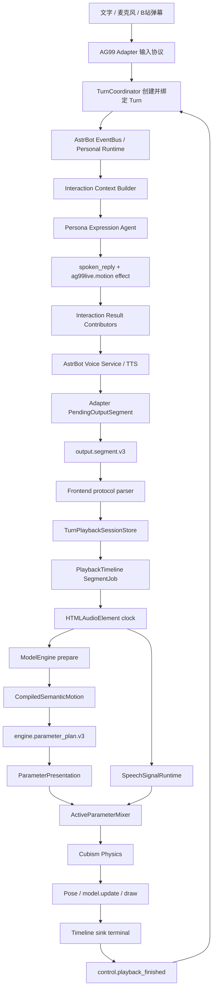

# 角色表演主流程与编排职责审计

本文以当前 AG99live 与配套 AstrBot 源码为准，梳理从用户输入到 Live2D 最终绘制的真实主流程，
并确认二期 Performance Director 应收口哪些职责、不得接管哪些职责。

本文不是新的运行协议，也不是目标模块清单。它首先记录现状，再给出阶段 A 的最小迁移边界。

关联文档：

- [二期角色表演系统总体规划](./18-二期角色表演系统总体规划.md)
- [端到端消息与统一播放链路](../01-架构与结构/05-端到端消息播放时序图.md)

## 1. 审计结论

当前主链路整体是通的，基础所有权也基本合理：

- AstrBot 拥有事件队列、Persona、主模型调用和 TTS。
- Adapter 拥有能力投影、动作 effect 校验、身份关联和原子 Segment 交接。
- SessionStore 保存协议事实，PlaybackTimeline 拥有实时播放生命周期和统一时钟。
- ModelEngine 完成语义动作与模型参数的两阶段编译。
- ParameterPresentation 执行主动参数轨迹与动力学。
- ActiveParameterMixer 只融合已经求值的主动参数贡献。
- Cubism Physics 在主动参数之后解算头发、衣服和饰品。

现阶段的主要结构问题不是重复播放器或重复参数写入，而是**整段表演的编排事实分散在多个正确但
互不共享同一编排上下文的阶段中**：

```text
timingStage                    决定整段时间和曲线预设
SpeechPoseStage                自己拆分文本 phrase 并生成说话手势
parameterTrackGraphCompiler    按 duration_weight 独立分配 sequence step
ParameterPresentation          决定 blend、hold、release 和动力学追赶
SpeechSignalRuntime            根据实时音频能量调整说话调制增益
```

这些模块本身不应被合并成一个巨型运行时对象，但它们需要共享一份由 ModelEngine 编译产生的
`PerformanceSchedule`。Performance Director 应是这份编排结果的唯一生成职责。

## 2. 完整主流程



### 2.1 用户输入进入 Adapter

主要源码：

- `astrbot_plugin_ag99live_adapter/runtime/turn_coordinator.py`
- `astrbot_plugin_ag99live_adapter/platform_adapter.py`

文字输入通过 `input.text` 进入 `TurnCoordinator._commit_inbound_message()`；麦克风输入先经过
Speech Ingress，生成消息对象后进入同一个提交入口。

该入口：

1. 绑定前端 `turn_id` 与 AstrBot 后端 Turn 身份。
2. 发送 `control.turn_started`。
3. 创建 AstrBot 平台事件并关闭 streaming。
4. 将事件提交给 AstrBot EventBus。
5. 记录 Motion Lab 的 `turn.input_received` 原始事实。

Adapter 不在这里调用大模型，也不因上一轮仍在前端播放而拒绝新输入。AstrBot 自己的事件队列与
Personal Runtime 负责后端 Turn 顺序。

### 2.2 AstrBot 构建 Persona 上下文

主要源码：

- `astrbot/core/interaction/personal_runtime.py`
- `astrbot/core/interaction/context_builder.py`
- `astrbot_plugin_ag99live_adapter/middleware/interaction_motion/prompt.py`
- `astrbot_plugin_ag99live_adapter/middleware/interaction_motion/prompt_builder.py`
- `astrbot_plugin_ag99live_adapter/middleware/interaction_motion/prompt_context.py`

Personal Runtime 接纳平台事件后，Interaction Context Builder 构建基础上下文和插件上下文。
AG99 Prompt Contributor 向 Persona 提供：

- 当前模型 `SemanticAxisProfile` 和可用资源。
- 九级 `-4..4` 动作契约。
- pose / sequence 固定结构示例。
- 与当前输入相关的人工参考样本。
- 上一次动作的紧凑摘要，用于有限变化提示。

配套 AstrBot 会等待插件上下文完成；Contributor 异常、超时或非法结果在严格模式下显式失败，
不退回缺少动作能力的基础 Prompt。

### 2.3 Persona 同时生成文本和动作 effect

主要源码：

- `astrbot/core/interaction/expression_agent.py`
- `astrbot/core/interaction/effects.py`
- `astrbot_plugin_ag99live_adapter/middleware/interaction_motion/effects.py`

Persona Expression Agent 的结构化结果是：

```text
PersonaExpressionResult
├─ spoken_reply
└─ effect_calls[]
```

AG99 注册唯一 `ag99live.motion` Persona Effect。一次 assistant segment 应当只有一个该 effect，
effect 内使用：

- 单姿态 `axis_levels`；或
- 2–4 步 `motion_steps + duration_weight`；或
- 一个完整 motion resource。

主模型拥有语义方向、九级强度、少量语义步骤和可选资源选择权，但不生成 Live2D 最终参数、
逐帧数组、phrase 时间戳或 Physics 参数。

### 2.4 Result Contributor 解析动作并准备可选曲线

主要源码：

- `astrbot_plugin_ag99live_adapter/middleware/interaction_motion/scheduling.py`
- `astrbot_plugin_ag99live_adapter/motion/payload_validation.py`

`AG99liveMotionResultContributor` 从本次 Persona result view 中读取 effect calls，完成：

1. 提取唯一 `ag99live.motion`。
2. 按当前模型能力和协议规范化动作载荷。
3. 记录原始 effect、解析原因和 assistant text 到 Motion Lab。
4. 将动作作为 `ag99live.motion_payload` client object 交给物理输出层。
5. 仅在动作与文本都存在时登记 optional performance curve 请求材料。

动作应存在但 effect 缺失时，会留下明确的 motion schedule failure。它不会生成默认动作。

### 2.5 AstrBot 执行 TTS 和物理输出

主要源码：

- `astrbot/core/interaction/output_controller.py`
- AstrBot Voice Service

Output Controller 先收集 Result Contributor，再为逻辑输出段分配 `message_id`，随后调用 Voice
Service。每次 TTS 使用独立 `tts_request_id`，成功时生成 `Record` 和 TTS delivery metadata，
失败时生成明确的 audio-failed segment metadata。

optional performance curve 在 TTS 生命周期已经获得 `turn_id + message_id + tts_request_id` 后启动。
它只提供整段 entry / hold / exit / emphasis / energy hint，可以失败、超时或被跳过；不能阻塞
TTS、Segment 出站或基础动作。

### 2.6 Adapter 聚合原子输出段

主要源码：

- `astrbot_plugin_ag99live_adapter/runtime/output_segment.py`
- `astrbot_plugin_ag99live_adapter/runtime/turn_coordinator.py`
- `astrbot_plugin_ag99live_adapter/protocol/builder.py`

AstrBot 可能把一条逻辑回复以多个物理 MessageChain 回调给平台，Adapter 不按回调次数创建回复，
而是按逻辑 `message_id` 合并到 `PendingOutputSegment`：

```text
turn_id
+ message_id
+ canonical assistant text
+ TTS terminal state / tts_request_id / audio path
+ motion slot
+ optional performance curve outcome
```

`close_turn_output_queue()` 要求至少成功发送一个完整 `output.segment.v3`，随后发送
`control.synth_finished`。`synth_finished` 只表示后端不再为该 Turn 产生输出，不表示前端已经播放完。

### 2.7 前端协议校验和 SessionStore 提交

主要源码：

- `frontend/src/adapter-connection/inbound/inboundEvents.ts`
- `frontend/src/adapter-connection/inbound/inboundOutputDispatcher.ts`
- `frontend/src/turn-playback/useTurnPlaybackSessionStore.ts`

前端先按 schema manifest 和本地类型校验 `output.segment.v3`。动作、音频 URL 或身份非法时显式
拒绝，不能把不完整段写入 SessionStore。

SessionStore 一次性提交完整 Segment，并保存：

- text / audio / motion 的协议槽位状态。
- 后端 `synth_finished` 与 `turn_finished` 事实。
- Timeline 已启动、终止后的稳定投影。

SessionStore 不播放音频、不推进动作时钟，也不维护第二套 sink 状态机。

### 2.8 PlaybackTimeline 创建统一执行生命周期

主要源码：

- `frontend/src/turn-playback/useTurnPlaybackOrchestrator.ts`
- `frontend/src/playback-timeline/segmentJobExecutor.ts`
- `frontend/src/playback-timeline/playbackTimelineRuntime.ts`
- `frontend/src/app/playbackTimelineWiring.ts`

Orchestrator 只为完整且尚未释放的 Segment 创建 `SegmentJob`。Timeline 按同一 Segment 管理：

- 字幕 sink。
- 音频 sink。
- 动作 sink。
- 口型与音频信号生命周期。

有音频时：

1. 先创建音频 Timeline。
2. HTMLAudioElement 提供真实时长和 `currentTime`。
3. 音频时长可用后调用 `ModelEngine.preparePlaybackTimeline()`。
4. 音频进入 playing 后启动动作 sink 和口型信号。

没有音频但有动作时，Timeline 创建明确的 synthetic motion-only clock。不能用墙钟 timer 冒充音频
Timeline，也不能在缺少所需时钟时启动动作。

### 2.9 ModelEngine 第一阶段：语义编译

主要源码：

- `frontend/src/model-engine/compiler/compileSemanticMotion.ts`
- `frontend/src/model-engine/compiler/registry.ts`
- `frontend/src/model-engine/compiler/stages/intentValidator.ts`
- `frontend/src/model-engine/compiler/stages/axisResolver.ts`
- `frontend/src/model-engine/compiler/stages/intensityStage.ts`
- `frontend/src/model-engine/compiler/stages/semanticAxisRelationGraphStage.ts`
- `frontend/src/model-engine/compiler/stages/timingStage.ts`

第一阶段把 `engine.motion_intent.v4` 编译成 `CompiledSemanticMotion`：

```text
协议校验
-> 九级锚点区间采样
-> 强度缩放
-> 语义轴关系图
-> 模式和整段 timing
-> pose 或 sequence 的模型无关语义结果
```

每个 sequence step 独立完成语义轴编译，但这里只保留 `durationWeight`，不解析文本 phrase，也不
分配绝对时间。

### 2.10 ModelEngine 第二阶段：模型参数编译

主要源码：

- `frontend/src/model-engine/compiler/compileModelParameterPlan.ts`
- `frontend/src/model-engine/compiler/stages/speechPoseStage.ts`
- `frontend/src/model-engine/compiler/stages/modelParameterBindingStage.ts`
- `frontend/src/model-engine/compiler/stages/parameterTrackGraphStage.ts`
- `frontend/src/model-engine/compiler/parameterTrackGraphCompiler.ts`

第二阶段读取当前模型 Profile，将语义动作绑定为 `engine.parameter_plan.v3`。

对于 pose：

```text
SpeechPoseStage
-> 参数绑定
-> ParameterTrackGraphStage
-> resource policy
```

对于 sequence，当前实现先把每个 step 编译为 pose plan，再由
`compileParameterSequenceTrackGraph()` 合并成一份最终参数计划。只有第一步启用 SpeechPoseStage，
它生成的 modulation 会随最终参数项覆盖整段 sequence；sequence 自身仍按 `durationWeight` 独立
分配 step start time。

### 2.11 WebSDK 逐帧执行顺序

主要源码：

- `frontend/src/live2d/WebSDK/src/lappmodel.ts`
- `frontend/src/live2d/WebSDK/src/parameterpresentation.ts`
- `frontend/src/live2d/WebSDK/src/parametermixer.ts`
- `frontend/src/live2d/WebSDK/src/speechsignalruntime.ts`

当前每帧顺序是：

```text
deltaTime
-> drag manager
-> SpeechSignalRuntime 更新 RMS / lip-sync envelope
-> loadParameters
-> Cubism Motion 或 Idle Motion
-> saveParameters
-> EyeBlink
-> Expression
-> Drag
-> Breath
-> ParameterPresentation 求 direct-plan 当前帧
-> ActiveParameterMixer 融合 direct-plan + lip-sync
-> Cubism Physics
-> Cubism Pose
-> model.update
-> renderer draw
```

这个顺序符合当前所有权：AG99 主动参数在 Physics 之前写入，Physics 读取主动动作作为输入，
但 Physics 输出不回到主动参数平滑和 Mixer。

### 2.12 播放完成与后端收口

主要源码：

- `frontend/src/turn-playback/usePlaybackCompletionCoordinator.ts`
- `astrbot_plugin_ag99live_adapter/runtime/turn_coordinator.py`

前端只有在以下事实同时成立后，才发送 `control.playback_finished`：

- 本 Turn 所有 required Timeline sink 已终止。
- SessionStore 中 text / audio / motion 已稳定。
- 已收到后端 `control.synth_finished`。

Adapter 根据该消息自己的 `turn_id` 收口对应 Turn，不依赖最新输入轮次，因此较新输入可以已经进入
AstrBot，而较早 Turn 仍独立完成前端播放。

## 3. 身份、时钟和数据事实

| 事实 | 唯一含义 | 所有者 |
| --- | --- | --- |
| `turn_id` | 一轮用户交互 | AstrBot / Adapter / 前端共同关联 |
| `message_id` | 一个逻辑 assistant 输出段 | AstrBot Output Controller 分配 |
| `tts_request_id` | 一次 TTS 生成生命周期 | AstrBot Voice Service |
| `run_id` | 一次已接受的动作执行 | ModelEngine / WebSDK |
| canonical assistant text | 当前 Segment 实际说出的文本 | AstrBot 输出，Segment 固化 |
| audio duration/currentTime | 当前播放时钟事实 | HTMLAudioElement / PlaybackTimeline |
| semantic direction/level | 角色本句想表达的动作语义 | 主模型 effect |
| final active parameter frame | 当前帧主动参数唯一结果 | ActiveParameterMixer |
| Physics output | 头发、衣服、饰品等被动响应 | Cubism Physics |

Performance Director 不应重新创建这些身份或事实，只能读取它们并在 ModelEngine 编译期产生表演
时间结构。

## 4. 当前表演编排职责分布

| 当前实现 | 输入 | 输出 | 是否迁入 Director 所有权 |
| --- | --- | --- | --- |
| `timingStage` | duration hint、音频目标时长、curve hint | 整段 timing | 是，作为基础时长策略 |
| `SpeechPoseStage.segmentAssistantText()` | canonical text | phrase、边界、权重、强调 | 是，作为统一 phrase 分析 |
| `SpeechPoseStage.buildGestureTrack()` | phrase、voice profile、seed | 说话 modulation | 是，作为部位编排策略 |
| `resolveStepStartTimes()` | sequence duration weights | step start time | 是，作为语义步骤编排 |
| `resolveTrackTimingPolicy()` | semantic group | 部位延迟、hold、residual | 是，作为部位时间策略 |
| `ParameterPresentation` | 已编译轨道、Timeline delta | 当前帧主动轨迹和动力学 | 否，保持执行层 |
| `SpeechSignalRuntime` | 实时 RMS / lip-sync | 实时 gain 和口型强度 | 否，保持实时音频信号层 |
| `ActiveParameterMixer` | base、direct plan、lip-sync | 最终主动参数帧 | 否，保持融合层 |
| `Cubism Physics` | 当前主动参数和 physics profile | 被动参数响应 | 否，保持 SDK 求解层 |

## 5. 当前结构问题

### 5.1 Phrase 与 sequence 使用两套独立时间分配

`SpeechPoseStage` 根据标点和有效字符长度生成 phrase 窗口；`parameterTrackGraphCompiler` 根据
`durationWeight` 生成 sequence step start time。两者只共享总时长，没有共享 phrase identity、
step identity 或共同 schedule。

直接结果是：

- 第二个语义动作不能明确绑定第二个 phrase。
- 说话手势可能在语义姿态转换的同时发生反向变化。
- hesitation、gaze lead 和句尾 residual 无法基于同一语义节点安排。
- Motion Lab 能看到最终轨道，但难以解释某个节点对应哪段文本。

### 5.2 部位时间策略同时存在于编译层和执行层

编译层已经决定 `transitionOffsetMs / transitionMs / preferredHoldMs / residualMs`，执行层又通过
blend、ownership release、bounded/spring response 决定实际到达和释放形态。

两者不是重复实现：前者是**何时改变目标**，后者是**身体怎样追赶目标**。问题在于当前诊断没有把
这两个阶段清楚关联，容易把“编排节点太晚”和“动力学太慢”混为同一个观感问题。

### 5.3 Sequence 的 SpeechPose 所有权是隐式的

sequence 只在第一步启用 SpeechPoseStage，再把第一步参数项的 modulation 带入整段最终计划。
这一行为能让说话手势覆盖整段，但它依赖编译流程结构，不是一个明确的表演编排契约。

### 5.4 最近动作多样性只在 Prompt 侧有限存在

当前 Prompt 可以读取上一动作摘要和本轮相关人工样本，但没有最近数轮动作族分布，也没有一份
ModelEngine 可读取的多样性约束。Performance Director 规划中提到的最近动作摘要尚未实现，
不能把它写成当前输入事实。

### 5.5 Physics 只有全局末端倍率，缺少 setting 级事实

当前帧顺序和主动/被动参数隔离是正确的，但 Director 目前无法知道某个主动动作会激发哪组头发、
衣服或饰品 Physics。该信息应由后续 Physics diagnostics/profile 提供，不能让 Director 手工控制
Physics 输出参数。

## 6. 阶段 A 的最小目标结构

阶段 A 不改变外部协议、PlaybackTimeline、`engine.parameter_plan.v3` 或 WebSDK 播放接口。
它只在 ModelEngine 内建立共享编排结果：

```text
CompiledSemanticMotion
+ canonical assistant text
+ resolved audio duration
+ SemanticAxisProfile / VoiceFollowingProfile
+ sampling identity
+ optional performance curve hint
                 ↓
Performance Director
                 ↓
PerformanceSchedule（内部 DTO）
├─ total timing
├─ phrase slots
├─ semantic step slots
├─ body-part events
├─ release / residual policy
└─ diagnostics / source trace
                 ↓
Parameter Track Graph Compiler
                 ↓
engine.parameter_plan.v3
```

第一版 `PerformanceSchedule` 应至少表达：

```text
durationMs
phrases[]: id, text, boundary, weight, estimated window
semanticSteps[]: index, durationWeight, estimated window
events[]: source, semanticGroup, atMs, transitionMs, holdMs, residualMs
diagnostics[]: decision source and compression/constraint reason
```

在 V4 还没有 phrase identity 的情况下，`semanticSteps` 与 `phrases` 只能标记为 estimated alignment，
不能伪造精确语义绑定。真正的显式对应需要后续协议提供 phrase identity 或 text span。

## 7. 阶段 A 的迁移范围

建议按以下顺序分批迁移：

1. 从 `SpeechPoseStage` 提取文本 phrase 分析，使其成为共享的纯编译输入。
2. 将 `resolveStepStartTimes()` 与整段 timing 组织为统一 schedule builder。
3. 把 `resolveTrackTimingPolicy()` 和 SpeechPose gesture point 生成改为消费同一 schedule。
4. Parameter Track Graph Compiler 只把 schedule 编译为参数 keyframes 和 modulation。
5. 增加 Director 级诊断，明确记录 phrase、semantic step、部位事件和最终参数节点的来源。
6. 删除迁移后仍在原阶段重复计算 phrase 或 step 时间的旧代码。

以下内容阶段 A 不动：

- AstrBot Persona、TTS 和输出生命周期。
- Adapter 协议与 `output.segment.v3`。
- PlaybackTimeline 和 HTMLAudioElement 时钟。
- ParameterPresentation 的 bounded/spring 动力学。
- ActiveParameterMixer 的 base/direct-plan/lip-sync 融合。
- SpeechSignalRuntime 的实时能量 envelope。
- Cubism Physics 和最终绘制顺序。

## 8. 完成标准

阶段 A 完成时应满足：

- phrase、sequence step、部位延迟和 residual 使用同一份内部 schedule。
- 同一时间事实不再由 SpeechPose 和 sequence compiler 各自重复计算。
- Parameter Track Graph 只负责把编排结果投影为参数计划。
- Director 不维护运行时状态，不读取全局字幕，不创建第二套时钟。
- Motion Lab 可以解释“哪段文本、哪个语义步骤、哪个部位事件”生成了最终参数节点。
- 现有 V4、parameter plan v3、Timeline、Mixer 和 WebSDK 外部接口保持不变。
- 编排失败显式返回阶段和原因，不以 speech-only、默认动作或旧路径兜底。

## 9. 下一批源码工作

下一批先做阶段 A 的第一小批：

1. 定义内部 `PerformanceSchedule` 和 Director 输入契约。
2. 迁移 `SpeechPoseStage` 的 phrase 分析为共享纯函数。
3. 让现有 SpeechPoseStage 先消费该 schedule，保持外部行为基本不变。
4. 审阅并删除重复的 phrase 时间计算入口。

完成这一批后，再把 sequence step 时间分配迁入同一 schedule。这样每次提交都保持可审阅和可回退，
不会一次性重写整个 ModelEngine。
